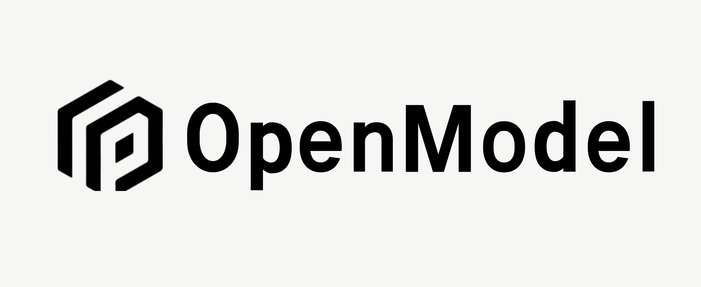
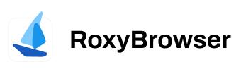
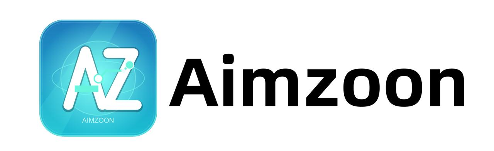
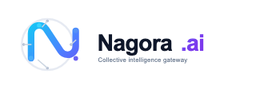
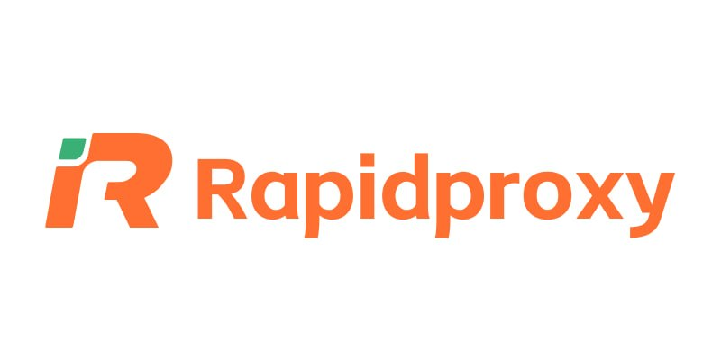
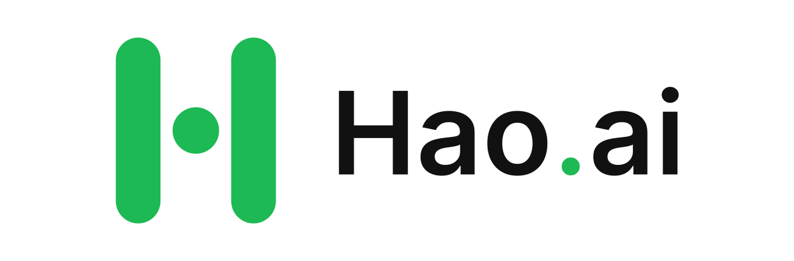
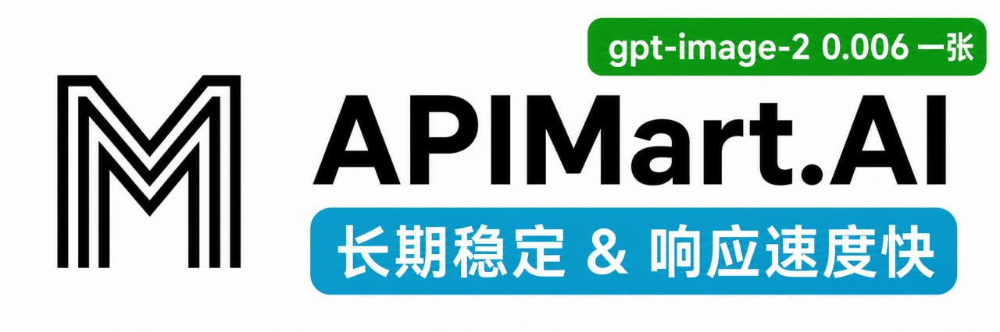

<div align="center">


# Sub2API

[](https://golang.org/)
[](https://vuejs.org/)
[](https://www.postgresql.org/)
[](https://redis.io/)
[](https://www.docker.com/)

<a href="https://trendshift.io/repositories/21823" target="_blank"></a>

**AI API 閘道器平臺 - 訂閱配額分發管理**

[English](README.md) | 中文 | [日本語](README_JA.md)

</div>


## ⚠️ 重要提醒

使用本專案前，請務必仔細閱讀以下內容：

- **🚨 服務條款風險**：使用本專案可能違反 Anthropic 等上游服務商的服務條款。請在使用前仔細閱讀相關服務商的使用者協議，由此產生的一切風險由使用者自行承擔。
- **⚖️ 合規使用**：請在符合您所在國家或地區法律法規的前提下使用本專案，嚴禁將其用於任何違法違規用途。
- **📖 免責宣告**：本專案僅供技術學習與研究使用，作者不對因使用本專案導致的帳戶封禁、服務中斷、資料丟失或其他任何直接或間接損失承擔責任。
- **🚫 無商業授權**：本專案從未授權任何個人或組織基於本專案開展任何形式的商業化運營。任何以本專案名義或基於本專案從事的商業行為均與本專案及其開發者無關，由此產生的一切糾紛、損失和法律責任由行為主體自行承擔。

## ❤️ 贊助商

> [想出現在這裡？](mailto:support@sub2api.org)

<table>

<tr>
<td width="180"><a href="https://cctk.ai/register?aff=SUB2API"></a></td>
<td>感謝 CCTK.AI 贊助了本專案！<a href="https://cctk.ai/register?aff=SUB2API">CCTK.AI</a> 是一個專注於穩定與價效比的 AI API 閘道器平臺，提供 Claude、OpenAI、Gemini 等主流模型的高速中轉服務，無縫相容 Claude Code、Codex 等主流程式設計工具，以遠低於官方的成本獲得同等的模型能力。點選<a href="https://cctk.ai/register?aff=SUB2API">此連結</a>註冊，即刻體驗更快、更穩、更省的 AI API 接入。</td>
</tr>

<tr>
<td width="180"><a href="https://www.openmodel.ai?ref=sub2api"></a></td>
<td>一個API，頂級模型隨便用！<a href="https://www.openmodel.ai?ref=sub2api">OpenModel</a> 專注於生產級、高可用的 AI API 閘道器，讓你的應用真正做到高速穩定：自動故障轉移、智慧選最優渠道、生產級 SLA 保障。遠超單一供應商的 SLA，讓穩定性成為您的核心競爭力。</td>
</tr>

<tr>
<td width="180"><a href="https://etok.ai"></a></td>
<td>感謝 ETok.ai 贊助了本專案！ETok.ai 致力於打造一站式 AI 程式設計工具服務平臺。我們提供 Claude Code 專業套餐及技術社群服務，同時支援 Google Gemini 和 OpenAI Codex。通過精心設計的套餐方案和專業的技術社群，為開發者提供穩定的服務保障和持續的技術支援，讓 AI 輔助程式設計真正成為開發者的生產力工具。點選<a href="https://etok.ai">這裡</a>註冊！</td>
</tr>

<tr>
<td width="180"><a href="https://apikey.fan/register?aff=SUB2API"></a></td>
<td>感謝 APIKEY.FUN 贊助了本專案！<a href="https://apikey.fan/register?aff=SUB2API">APIKEY.FUN</a> 是 sub2api 開源專案的核心貢獻者之一，致力於提供開放、穩定、高價效比的 AI API 接入服務。平臺支援 Claude、OpenAI、Gemini 等熱門模型的 API 中轉服務，價格低至官方原價的 7%。通過專屬連結 <a href="https://apikey.fan/register?aff=SUB2API">APIKEY</a> 註冊，可享受充值最高 95 折優惠。</td>
</tr>

<tr>
<td width="180"><a href="https://aigocode.com/invite/SUB2API"></a></td>
<td>感謝 AIGoCode 贊助了本專案！AIGoCode 是一站式整合 Claude Code、Codex 以及最新 Gemini 模型的綜合平臺，為您提供穩定、高效、高價效比的 AI 程式設計服務。平臺提供靈活的訂閱方案，零封號風險，免 VPN 直連，響應極速。AIGoCode 為 sub2api 使用者準備了專屬福利：通過<a href="https://aigocode.com/invite/SUB2API">此連結</a>註冊，首次充值可額外獲得 10% 贈送額度！</td>
</tr>

<tr>
<td width="180"><a href="https://codex-everywhere.com"></a></td>
<td>Real GPT-5.6 series at 3% of OpenAI pricing — <a href="https://codex-everywhere.com">CodexEverywhere</a> is democratizing access to frontier models for developers worldwide. We believe in transparency and honesty, with model quality verified by active community oversight for months. USD and crypto friendly. Start with a free $20 trial at <a href="https://codex-everywhere.com">codex-everywhere.com</a>.</td>
</tr>

<tr>
<td width="180"><a href="https://shop.bmoplus.com/?utm_source=github"></a></td>
<td>感謝 BmoPlus 贊助了本專案！BmoPlus 是一家專為AI訂閱重度使用者打造的可靠 AI 帳號代充服務商，提供穩定的 ChatGPT Plus / ChatGPT Pro(全程質保) / Claude Pro / Super Grok / Gemini Pro 的官方代充&成品帳號。 通過<a href="https://shop.bmoplus.com/?utm_source=github">BmoPlus AI成品號專賣/代充</a>註冊下單的使用者，可享GPT 官網訂閱一折 的震撼價格！</td>
</tr>

<tr>
<td width="180"><a href="https://bestproxy.com/?keyword=a2e8iuol"></a></td>
<td>感謝 Bestproxy 贊助了本專案！<a href="https://bestproxy.com/?keyword=a2e8iuol">Bestproxy</a> 是一家提供高純度住宅IP，支援一號一IP獨享，結合真實家庭網路與指紋隔離，可實現鏈路環境隔離，降低關聯風控機率。</td>
</tr>

<tr>
<td width="180"><a href="https://pateway.ai/?ch=1tsfr51"></a></td>
<td>感謝 PatewayAI 贊助了本專案！PatewayAI 是一家面向重度 AI 開發者、專注官方直連的高品質模型 API 中轉服務商。提供 Claude 全系列與 Codex 系列模型，100% 官方源直供，不摻假不注水，歡迎檢驗。計費透明，Token 級帳單可逐筆核驗。
同時支援企業級高併發，併為企業客戶提供了專業的管理平臺，企業客戶可簽訂正式合同並開具發票，更多詳情進入官網獲取聯絡方式。
現在通過 <a href="https://pateway.ai/?ch=1tsfr51">此連結</a> 註冊即送 $3 試用額度，使用者充值低至 6 折，邀請好友雙向贈送，邀請獎勵可達 $150。</td>
</tr>

<tr>
<td width="180"><a href="https://api.pptoken.cc/register?promo=SUB2API"></a></td>
<td>感謝 PPToken.cc 贊助本專案！ <a href="https://api.pptoken.cc/register?promo=SUB2API">PPToken.cc</a> 主打 GPT 系列模型 API 中轉服務，支援 Codex、Claude Code、OpenAI 相容客戶端及 Gemini CLI 等工具接入。充值 1:1，1 元=1 美元額度；GPT 模型最低 0.16 倍倍率，綜合成本約為官方價格的 0.22 折，最快首字 Token 約 1 秒，適合開發者低成本、高響應速度接入 GPT 模型能力。技術支援： 7×24 小時真人響應（不是機器人），群內@技術，10 分鐘內有回覆 。贊助商福利：前 200 名使用者通過 <a href="https://api.pptoken.cc/register?promo=SUB2API">[專屬註冊連結]</a> 註冊，輸入優惠碼 `SUB2API`，可領取 Codex / Claude Code 免費試用額度，無門檻、不綁卡。
</td>
</tr>

<tr>
<td width="180"><a href="https://veilx.io/#/hello/SJRBRVDV"></a></td>
<td>感謝 Veilx 贊助本專案！ <a href="https://veilx.io/#/hello/SJRBRVDV">Veilx</a> CDN 專為超大規模 API 請求場景打造，針對 AI 中轉站業務與 AI API 呼叫鏈路進行了深度最佳化，輕鬆應對高併發、高頻請求與大流量傳輸，為開發者與企業提供更快、更穩、更低延遲的加速體驗。無論是 OpenAI、Claude、Gemini 等 AI 介面中轉，還是聊天、繪圖、Embedding、流式輸出等複雜場景，Veilx 都能顯著提升響應速度與連線穩定性，有效降低網路波動帶來的超時與失敗問題。同時，Veilx 提供中國三網最佳化回國極速線路，大幅提升中國大陸地區訪問海外 AI 服務的速度與穩定性，特別適合全球 AI 中轉平臺、海外 AI SaaS、跨境業務與高併發 API 系統部署。專為 AI API 而生，讓你的 AI 中轉服務更快、更穩、更省心。<a href="https://veilx.io/#/hello/SJRBRVDV">購買地址</a>
</td>
</tr>

<tr>
<td width="180"><a href="https://roxybrowser.com/invite/bgGKG7"></a></td>
<td>感謝 RoxyBrowser 贊助本專案！<a href="https://roxybrowser.com/invite/bgGKG7">RoxyBrowser</a> 是 Sub2API 的理想搭檔：內建原生 Roxy AI Agent 與高質量原生住宅 IP，支援通過簡單命令實現批次自動化，顯著提升多帳號管理的安全性與效率！點選<a href="https://roxybrowser.com/invite/bgGKG7">此連結</a>註冊，可領取免費住宅 IP 套餐與終身 9 折優惠。
</td>
</tr>

<tr>
<td width="180"><a href="https://www.proxy4free.com/?keyword=4yjqecpc"></a></td>
<td>感謝 Proxy4Free 贊助本專案！Proxy4Free 是面向開發者和 AI 應用的資料代理服務商，提供住宅代理、靜態住宅代理、ISP 代理及資料中心代理等多種代理解決方案，適用於 Web Scraping、Browser Automation、AI Agent 等場景。支援全球 IP 資源、穩定連線與靈活切換，幫助開發者提升資料採整合功率，降低 IP 封禁風險。通過<a href="https://www.proxy4free.com/?keyword=4yjqecpc">此連結註冊</a>即可開始體驗，輕鬆構建更穩定、高效的自動化工作流。
</td>
</tr>

<tr>
<td width="180"><a href="http://aimzoon.com"></a></td>
<td>感謝 Aimzoon 對本專案的贊助！ <a href="http://aimzoon.com">Aimzoon</a> 提供穩定、高價效比的 AI API 接入服務，支援開發者將常用 AI 服務快速接入 Codex、Claude Code、Gemini CLI 等程式設計工具。無需複雜配置，更快接入，更穩呼叫，更省成本。codex倍率優惠，特價倍率等促銷不斷，註冊即送免費體驗額度，讓 AI 程式設計真正進入日常工作流。<a href="http://aimzoon.com">點選這裡</a>註冊體驗！
</td>
</tr>

<tr>
<td width="180"><a href="https://nagora.ai/"></a></td>
<td><a href="https://nagora.ai/">Nagora</a> 是專為開發者和團隊打造的多模型 AI API 閘道器。通過一個帳戶和一枚 API Key，即可統一呼叫 26+ 款主流文本與影像模型，相容 OpenAI、Anthropic 與 Gemini 協議，並可無縫接入 Claude Code、Codex、Gemini CLI 等開發工具。平臺提供智慧路由、自動故障轉移、透明計費與統一帳單，同時支援預算、限速、併發控制，讓個人開發、團隊協作和生產環境中的 AI 呼叫更穩定、更可控。無需改造現有應用，只需替換 Base URL 與 API Key，最快 1 分鐘即可完成接入。</td>
</tr>

<tr>
<td width="180"><a href="https://s.qiniu.com/u6rQrq"></a></td>
<td>感謝 七牛雲AI 贊助本專案！七牛雲AI 是七牛雲（02567.HK）旗下企業級大模型 MaaS 平臺，一站式呼叫全球 150+ 主流模型，相容全球主流模型廠商協議，覆蓋文本、影像、音訊、影片、檔案處理等全模態處理能力，服務超過169萬企業及開發者使用者。七牛雲 AI 為 Sub2API 的使用者提供了專屬福利：通過<a href="https://s.qiniu.com/u6rQrq">此連結</a>註冊，企業使用者免費領1200萬Token，開發者免費領300萬Token。</td>
</tr>

<tr>
<td width="180"><a href="https://api.fenno.ai/s/dC4k"></a></td>
<td>感謝 FennoAI 贊助本專案！FennoAI 是一家面向企業研發團隊和開發者的高穩定、高效能 API 中轉服務商，相容 OpenAI 與 Anthropic 協議，可無縫接入 Codex、Claude Code、OpenCode 等主流 AI 程式設計工具。平臺具備企業級穩定性，可支撐千億 Token/日的呼叫規模，並支援境內外主體公對公結算及開票，滿足企業級研發與採購需求。作為 Sub2API 使用者專屬福利，通過<a href="https://api.fenno.ai/s/dC4k">專屬連結</a>購買訂閱，僅需 1.99 美元即可獲得價值 50 美元的 Coding Plan 額度。同時支援邀請獎勵，邀請好友購買最高可獲得 20% 返佣，邀請越多，獎勵越高。</td>
</tr>

<tr>
<td width="180"><a href="https://lanox.ai/?c=6"></a></td>
<td>感謝 LanoX AI 對本專案的贊助！<a href="https://lanox.ai/?c=6">LanoX AI</a> 為開發者、團隊與企業提供穩定、高價效比的全球模型接入服務。 🎁 新使用者福利 — 免費領取 百萬 Token ,更有500+ 免費模型 — 低成本測試、驗證、部署更輕鬆 🧠 全球主流模型 — GPT · Claude · Gemini · Qwen · Grok... 🎬 多模態創作 — Seedance 2.0 · GPT Image · Gemini Nano Banana 🛡️ 企業級穩定服務 — 高可用💎原生能力輸出💎不降智💎不混模💎呼叫與計費透明💎 💰 更低呼叫成本 — 頂級模型低至官方價 1 折起，檔案清晰、接入簡單、支援開票與企業批次呼叫 🏢 企業優選 — 適用於 AI 產品、Agent、內容平臺、研發團隊批次呼叫</td>
</tr>

<tr>
<td width="180"><a href="https://www.rapidproxy.io/?ref=sub2api"></a></td>
<td><a href="https://www.rapidproxy.io/?ref=sub2api">RapidProxy</a> 是面向開發者的資料採集代理解決方案，提供穩定可靠的住宅代理服務。通過 9000 萬+全球住宅 IP和 200+國家覆蓋、智慧輪換機制和精準地區定位能力，幫助爬蟲、AI 資料訓練、SEO 監控、電商資料分析等專案突破訪問限制，提高資料採集效率。支援 Playwright、Selenium、Puppeteer 等主流自動化框架，價格低至 $0.65/GB，<a href="https://www.rapidproxy.io/?ref=sub2api">立即免費測試吧</a>。</td>
</tr>

<tr>
<td width="180"><a href="https://hao.ai"></a></td>
<td><a href="https://hao.ai">hao.ai</a> 是面向開發者與團隊的高速、穩定大模型統一 API 閘道器。通過一個 API Key 和統一介面，即可接入 GPT、Claude、xAI Grok 等主流模型，相容 OpenAI、Anthropic 等常用協議與 SDK。平臺提供模型路由、故障回退、團隊管理及完整呼叫日誌，模型價格低至官方參考價的 1.5 折，幫助使用者更簡單、更穩定、更低成本地構建 AI 應用。</td>
</tr>

<tr>
<td width="180"><a href="https://www.swiftproxy.net/?ref=sub2api"></a></td>
<td>Swiftproxy 是面向開發者的高效能代理解決方案，提供穩定可靠的住宅代理和靜態住宅代理服務。擁有 9000 萬+ 純淨住宅 IP，覆蓋全球，支援靈活輪換和精準地理定位，幫助網頁抓取、AI 自動化、瀏覽器自動化、SEO 監控和多帳號管理等專案突破訪問限制，提升工作流效率。支援 HTTP(S) 和 SOCKS5 協議，相容 Playwright、Selenium、Puppeteer 等主流自動化工具，動態代理流量用完為止永不過期，支援免費測試 — <a href="https://www.swiftproxy.net/?ref=sub2api">立即開始免費測試</a>！</td>
</tr>

<tr>
<td width="180"><a href="https://www.duckip.cn/?keyword=cu7oog6y"></a></td>
<td><a href="https://www.duckip.cn/?keyword=cu7oog6y">DuckIP</a> - 9000 萬+ 全球住宅網路資源，覆蓋 195+ 國家和地區，支援輪換和粘性會話，適用於公共資料採集、RAG 更新、模型評估和多區域資料工作負載。🟢住宅代理 - 8 折優惠；🟢靜態住宅代理 - ¥50.00/IP 起；🟢無限住宅代理 - ¥19.8/小時 起。✅免費領取 500M 試用流量。</td>
</tr>

<tr>
<td width="180"><a href="https://go.apimart.ai/gh-sub2api"></a></td>
<td>感謝 APIMart 贊助了本專案！<a href="https://go.apimart.ai/gh-sub2api">APIMart</a> 是專注於 AI 圖片/影片生成的低價 API 平臺，GPT-Image-2 低至 $0.006/張，1 美元可生成 160+ 張圖片。圖片、影片一套非同步 API 通吃：提交任務獲取 ID，通過輪詢或回撥獲取結果；批次生成上萬張圖片也不會超時，切換模型無需修改程式碼。按量付費、無月費，通過<a href="https://go.apimart.ai/gh-sub2api">此註冊連結</a>註冊即可開始使用。</td>
</tr>

<tr>
<td width="180"><a href="https://www.axisnow.io/"></a></td>
<td>感謝 AxisNow 贊助了本專案！<a href="https://www.axisnow.io/">AxisNow</a> 保護並加速網站與 API，兼顧中國大陸及全球的訪問體驗，並通過客戶端 SDK，將加速與安全能力延伸至原生/移動 App — <strong>自建私有部署 CDN</strong>｜<strong>訂閱式高防 CDN</strong>｜<strong>自主可控、靈活組合的 CDN 網路</strong>。</td>
</tr>

<tr>
<td width="180"><a href="https://pp.dog/register?aff=SUB2API"></a></td>
<td><a href="https://pp.dog/register?aff=SUB2API">PP.dog</a> 是自建帳號池的源頭 API 閘道器，專注為下游中轉站與高頻開發者提供 API 閘道器中繼服務，幫您省去自建號池的一切麻煩——✅ 源頭直供：自持海量帳號池，無中間商賺差價；🧧 成本屠夫：綜合倍率低至 0.03x，成本僅為官方的千分之3.5；🚀 極速體驗：首 Token 延遲 < 1s，流暢媲美官方原生 API。<a href="https://www.pp.dog/register?aff=SUB2API">立即接入PP.dog</a></td>
</tr>

<tr>
<td width="180"><a href="https://colaproxy.com/?utm_source=sub2api&utm_medium=sub2api&ref=sub2api"></a></td>
<td>ColaProxy 提供專為網頁抓取、自動化和多帳號管理打造的高質量住宅代理。免費試用，流量永不過期，價格低至 $0.3/GB，支援無限併發連線和智慧 IP 輪換，帶來更流暢、更穩定的代理體驗。使用優惠碼 COLA10 立享 9 折優惠，立即開始使用可靠的住宅代理擴充套件您的專案。<a href="https://colaproxy.com/?utm_source=sub2api&utm_medium=sub2api&ref=sub2api">立即開始使用 ColaProxy</a></td>
</tr>

</table>

## 專案概述

Sub2API 是一個 AI API 閘道器平臺，用於分發和管理 AI 產品訂閱的 API 配額。使用者通過平臺生成的 API Key 呼叫上游 AI 服務，平臺負責鑑權、計費、負載均衡和請求轉發。

## 核心功能

- **多帳號管理** - 支援多種上游帳號型別（OAuth、API Key）
- **API Key 分發** - 為使用者生成和管理 API Key
- **精確計費** - Token 級別的用量追蹤和成本計算
- **智慧排程** - 智慧帳號選擇，支援粘性會話
- **併發控制** - 使用者級和帳號級併發限制
- **速率限制** - 可配置的請求和 Token 速率限制
- **內建支付系統** - 支援 EasyPay 易支付、支付寶官方、微信官方、Stripe，使用者自助充值，無需獨立部署支付服務（[配置指南](docs/PAYMENT_CN.md)）
- **管理後臺** - Web 介面進行監控和管理
- **外部系統整合** - 支援通過 iframe 嵌入外部系統（如工單等），擴充套件管理後臺功能

## 生態專案

圍繞 Sub2API 的社群擴充套件與整合專案：

| 專案 | 說明 | 功能 |
|------|------|------|
| ~~[Sub2ApiPay](https://github.com/touwaeriol/sub2apipay)~~ | ~~自助支付系統~~ | **已內建** — 支付功能已整合到 Sub2API 中，無需獨立部署。詳見 [支付配置指南](docs/PAYMENT_CN.md) |
| [sub2api-mobile](https://github.com/ckken/sub2api-mobile) | 移動端管理控制台 | 跨平臺應用（iOS/Android/Web），支援使用者管理、帳號管理、監控看板、多後端切換；基於 Expo + React Native 構建 |

## 技術棧

| 元件 | 技術 |
|------|------|
| 後端 | Go 1.27.0, Gin, Ent |
| 前端 | Vue 3.4+, Vite 5+, TailwindCSS |
| 資料庫 | PostgreSQL 15+ |
| 快取/佇列 | Redis 7+ |

---

## Nginx 反向代理注意事項

通過 Nginx 反向代理 Sub2API（或 CRS 服務）並搭配 Codex CLI 使用時，需要在 Nginx 配置的 `http` 塊中新增：

```nginx
underscores_in_headers on;
```

Nginx 預設會丟棄名稱中含下劃線的請求頭（如 `session_id`），這會導致多帳號環境下的粘性會話功能失效。

## Codex Fast/Flex 策略說明

管理員後臺的 `系統設定 -> 閘道器服務 -> OpenAI Fast/Flex 策略` 只負責處理請求體中的 `service_tier`，不會修改 Codex 客戶端的模型目錄，也不會讓 Codex UI 自動出現 Speed 或 `/fast` 選項。

策略支援以下處理方式：

- `pass`：保留客戶端傳入的 `service_tier`；`fast` 會規範為上游使用的 `priority`。
- `filter`：移除 `service_tier`，按普通優先順序請求。
- `block`：拒絕匹配的 Fast/Flex 請求。
- `force_priority`：將匹配請求強制設定為 `priority`，會按 Priority/Fast 價格計費。為避免升級後改變既有規則語義，`all` 只匹配顯式存在的 tier；如需讓省略 `service_tier` 的 OpenAI 請求也強制升級，必須新增 `service_tier=missing + force_priority` 規則。非 OpenAI 平臺不會執行預設 tier 注入。這種方式可以讓請求實際使用 Fast，但 Codex UI 仍可能不顯示 Fast 狀態。

Codex 的 Fast 入口由客戶端模型目錄驅動。只有當前模型目錄宣告瞭 `additional_speed_tiers: ["fast"]` 和對應的 `service_tiers`，Codex 才會顯示 `/fast`。通過 API Key 或自定義模型提供商連線 Sub2API 時，如果模型目錄沒有這些欄位，即使後臺配置了 `force_priority`，重啟 Codex 後也不會出現 Speed 選項。

客戶端可在 `~/.codex/config.toml` 中直接指定預設請求級別：

```toml
service_tier = "fast"

[features]
fast_mode = true
```

其中 `service_tier = "fast"` 會讓請求攜帶 Fast 設定；`features.fast_mode` 只啟用客戶端 Fast 功能。模型目錄沒有宣告 Fast 能力時，`/fast` 仍可能不顯示。可通過 Sub2API 使用記錄確認最終 `service_tier` 是否為 `priority`。

---

## 部署方式

### 方式一：指令碼安裝（推薦）

一鍵安裝指令碼，自動從 GitHub Releases 下載預編譯的二進位制檔案。

#### 前置條件

- Linux 伺服器（amd64 或 arm64）
- PostgreSQL 15+（已安裝並執行）
- Redis 7+（已安裝並執行）
- Root 許可權

#### 安裝步驟

```bash
curl -sSL https://raw.githubusercontent.com/Wei-Shaw/sub2api/main/deploy/install.sh | sudo bash
```

指令碼會自動：
1. 檢測系統架構
2. 下載最新版本
3. 安裝二進位制檔案到 `/opt/sub2api`
4. 建立 systemd 服務
5. 配置系統使用者和許可權

#### 安裝後配置

```bash
# 1. 啟動服務
sudo systemctl start sub2api

# 2. 設定開機自啟
sudo systemctl enable sub2api

# 3. 在瀏覽器中開啟設定嚮導
# http://你的伺服器IP:8080
```

設定嚮導將引導你完成：
- 資料庫配置
- Redis 配置
- 管理員帳號建立

#### 升級

可以直接在 **管理後臺** 左上角點選 **檢測更新** 按鈕進行線上升級。

網頁升級功能支援：
- 自動檢測新版本
- 一鍵下載並應用更新
- 支援回滾

#### 常用命令

```bash
# 檢視狀態
sudo systemctl status sub2api

# 檢視日誌
sudo journalctl -u sub2api -f

# 重啟服務
sudo systemctl restart sub2api

# 解除安裝
curl -sSL https://raw.githubusercontent.com/Wei-Shaw/sub2api/main/deploy/install.sh | sudo bash -s -- uninstall -y
```

---

### 方式二：Docker Compose（推薦）

使用 Docker Compose 部署，包含 PostgreSQL 和 Redis 容器。

#### 前置條件

- Docker 20.10+
- Docker Compose v2+

#### 快速開始（一鍵部署）

使用自動化部署指令碼快速搭建：

```bash
# 建立部署目錄
mkdir -p sub2api-deploy && cd sub2api-deploy

# 下載並執行部署準備指令碼
curl -sSL https://raw.githubusercontent.com/Wei-Shaw/sub2api/main/deploy/docker-deploy.sh | bash

# 啟動服務
docker compose up -d

# 檢視日誌
docker compose logs -f sub2api
```

**指令碼功能：**
- 下載 `docker-compose.local.yml`（本地儲存為 `docker-compose.yml`）和 `.env.example`
- 自動生成安全憑證（JWT_SECRET、TOTP_ENCRYPTION_KEY、POSTGRES_PASSWORD）
- 建立 `.env` 檔案並填充自動生成的金鑰
- 建立資料目錄（使用本地目錄，便於備份和遷移）
- 顯示生成的憑證供你記錄

#### 手動部署

如果你希望手動配置：

```bash
# 1. 克隆倉庫
git clone https://github.com/Wei-Shaw/sub2api.git
cd sub2api/deploy

# 2. 複製環境配置檔案
cp .env.example .env
chmod 600 .env

# 3. 編輯配置（生成安全密碼）
nano .env
```

**`.env` 必須配置項：**

```bash
# PostgreSQL 密碼（必需）
POSTGRES_PASSWORD=your_secure_password_here

# JWT 金鑰（推薦 - 重啟後保持使用者登入狀態）
JWT_SECRET=your_jwt_secret_here

# TOTP 加密金鑰（推薦 - 重啟後保留雙因素認證）
TOTP_ENCRYPTION_KEY=your_totp_key_here

# 可選：管理員帳號
ADMIN_EMAIL=admin@example.com
ADMIN_PASSWORD=your_admin_password

# 可選：自定義埠
SERVER_PORT=8080
```

**生成安全金鑰：**
```bash
# 生成 JWT_SECRET
openssl rand -hex 32

# 生成 TOTP_ENCRYPTION_KEY
openssl rand -hex 32

# 生成 POSTGRES_PASSWORD
openssl rand -hex 32
```

```bash
# 4. 建立資料目錄（本地版）
mkdir -p data postgres_data redis_data

# 5. 啟動所有服務
# 選項 A：本地目錄版（推薦 - 易於遷移）
docker compose -f docker-compose.local.yml up -d

# 選項 B：命名卷版（簡單設定）
docker compose up -d

# 6. 檢視狀態
docker compose -f docker-compose.local.yml ps

# 7. 檢視日誌
docker compose -f docker-compose.local.yml logs -f sub2api
```

#### 部署版本對比

| 版本 | 資料儲存 | 遷移便利性 | 適用場景 |
|------|---------|-----------|---------|
| **docker-compose.local.yml** | 本地目錄 | ✅ 簡單（打包整個目錄） | 生產環境、頻繁備份 |
| **docker-compose.yml** | 命名卷 | ⚠️ 需要 docker 命令 | 簡單設定 |

**推薦：** 使用 `docker-compose.local.yml`（指令碼部署）以便更輕鬆地管理資料。

#### 啟用“資料管理”功能（datamanagementd）

如需啟用管理後臺“資料管理”，需要額外部署宿主機資料管理程式 `datamanagementd`。

關鍵點：

- 主程式固定探測：`/tmp/sub2api-datamanagement.sock`
- 只有該 Socket 可連通時，資料管理功能才會開啟
- Docker 場景需將宿主機 Socket 掛載到容器同路徑

詳細部署步驟見：`deploy/DATAMANAGEMENTD_CN.md`

#### 訪問

在瀏覽器中開啟 `http://你的伺服器IP:8080`

如果管理員密碼是自動生成的，在日誌中查詢：
```bash
docker compose -f docker-compose.local.yml logs sub2api | grep "admin password"
```

#### 升級

```bash
# 拉取最新映象並重建容器
docker compose -f docker-compose.local.yml pull
docker compose -f docker-compose.local.yml up -d
```

#### 輕鬆遷移（本地目錄版）

使用 `docker-compose.local.yml` 時，可以輕鬆遷移到新伺服器：

```bash
# 源伺服器
docker compose -f docker-compose.local.yml down
cd ..
tar czf sub2api-complete.tar.gz sub2api-deploy/

# 傳輸到新伺服器
scp sub2api-complete.tar.gz user@new-server:/path/

# 新伺服器
tar xzf sub2api-complete.tar.gz
cd sub2api-deploy/
docker compose -f docker-compose.local.yml up -d
```

#### 常用命令

```bash
# 停止所有服務
docker compose -f docker-compose.local.yml down

# 重啟
docker compose -f docker-compose.local.yml restart

# 檢視所有日誌
docker compose -f docker-compose.local.yml logs -f

# 刪除所有資料（謹慎！）
docker compose -f docker-compose.local.yml down
rm -rf data/ postgres_data/ redis_data/
```

---

### 方式三：Apple container（macOS）

Apple 晶片 Mac 在 macOS 26 上可使用 Apple `container` 1.1.0 或更高版本執行完整的 Sub2API、PostgreSQL 和 Redis：

```bash
git clone https://github.com/Wei-Shaw/sub2api.git
cd sub2api/deploy
./apple-container.sh init
./apple-container.sh up
./apple-container.sh status
```

該方式面向本地開發和人工運維，不提供持續重啟監管；生產部署仍推薦 Docker Compose。生命週期命令、持久化、升級和執行時限制見 [deploy/APPLE_CONTAINER.md](deploy/APPLE_CONTAINER.md)。

---

### 方式四：原始碼編譯

從原始碼編譯安裝，適合開發或定製需求。

#### 前置條件

- Go 1.21+
- Node.js 18+
- PostgreSQL 15+
- Redis 7+

#### 編譯步驟

```bash
# 1. 克隆倉庫
git clone https://github.com/Wei-Shaw/sub2api.git
cd sub2api

# 2. 安裝 pnpm（如果還沒有安裝）
npm install -g pnpm

# 3. 編譯前端
cd frontend
pnpm install
pnpm run build
# 構建產物輸出到 ../backend/internal/web/dist/

# 4. 編譯後端（嵌入前端）
cd ../backend
VERSION="$(./scripts/resolve-version.sh)"
go build -tags embed -ldflags="-X main.Version=${VERSION}" -o sub2api ./cmd/server

# 5. 建立配置檔案
cp ../deploy/config.example.yaml ./config.yaml

# 6. 編輯配置
nano config.yaml
```

> **注意：** `-tags embed` 引數會將前端嵌入到二進位制檔案中。不使用此引數編譯的程式將不包含前端介面。

**`config.yaml` 關鍵配置：**

```yaml
server:
  host: "0.0.0.0"
  port: 8080
  mode: "release"

database:
  host: "localhost"
  port: 5432
  user: "postgres"
  password: "your_password"
  dbname: "sub2api"

redis:
  host: "localhost"
  port: 6379
  password: ""

jwt:
  secret: "change-this-to-a-secure-random-string"
  expire_hour: 24

default:
  user_concurrency: 5
  user_balance: 0
  api_key_prefix: "sk-"
  rate_multiplier: 1.0
```

`config.yaml` 還支援以下安全相關配置：

- `cors.allowed_origins` 配置 CORS 白名單
- `security.url_allowlist` 配置上游/價格資料/CRS 主機白名單
- `security.url_allowlist.enabled` 可關閉 URL 校驗（慎用）
- `security.url_allowlist.allow_insecure_http` 關閉校驗時允許 HTTP URL
- `security.url_allowlist.allow_private_hosts` 允許私有/本地 IP 地址
- `security.response_headers.enabled` 可啟用可配置響應頭過濾（關閉時使用預設白名單）
- `security.csp` 配置 Content-Security-Policy
- `billing.circuit_breaker` 計費異常時 fail-closed
- `security.trust_forwarded_ip_for_api_key_acl` 控制舊版原始轉發頭接管（為升級相容預設開啟）；關閉後嚴格使用 `server.trusted_proxies`，其中只應填寫直接連線 Sub2API 的精確代理 CIDR
- `security.forwarded_client_ip_headers` 最多配置 16 個第三方 CDN 客戶端 IP 請求頭；僅在舊版接管開啟時按順序優先於內建請求頭解析
- `turnstile.required` 在 release 模式強制啟用 Turnstile

自定義客戶端 IP 請求頭可通過 YAML 配置，也可使用逗號分隔的環境變數：

```bash
SECURITY_FORWARDED_CLIENT_IP_HEADERS=True-Client-IP,X-CDN-Client-IP
```

請求頭名稱會經過合法性校驗、規範化和大小寫無關去重。管理員可在安全設定中動態更新列表，無需重啟；新安裝會持久化 YAML/環境變數預設值，舊安裝缺少資料庫欄位時會自動回填。關閉舊版接管後，自定義頭和內建原始轉發頭均被忽略，只使用 `server.trusted_proxies`。開啟接管時必須限制源站僅允許 CDN/代理訪問，並確保邊緣代理覆蓋所有受信客戶端 IP 請求頭。完整遷移規則和信任邊界見 [`deploy/EDGE_SECURITY.md`](deploy/EDGE_SECURITY.md)。

**閘道器防禦縱深建議（重點）**

- `gateway.upstream_response_read_max_bytes`：限制非流式上游響應讀取大小（預設 `8MB`），用於防止異常響應導致記憶體放大。
- `gateway.proxy_probe_response_read_max_bytes`：限制代理探測響應讀取大小（預設 `1MB`）。
- `gateway.gemini_debug_response_headers`：預設 `false`，僅在排障時短時開啟，避免高頻請求日誌開銷。
- `/auth/register`、`/auth/login`、`/auth/login/2fa`、`/auth/send-verify-code` 已提供服務端兜底限流（Redis 故障時 fail-close）。
- 推薦將 WAF/CDN 作為第一層防護，服務端限流與響應讀取上限作為第二層兜底；兩層同時保留，避免旁路流量與誤配置風險。

**⚠️ 安全警告：HTTP URL 配置**

當 `security.url_allowlist.enabled=false` 時，系統僅執行最小 URL 校驗，且**預設允許 HTTP URL**（開發友好模式，Docker Compose 部署的預設值一致）。生產環境建議顯式收緊為僅允許 HTTPS：

```yaml
security:
  url_allowlist:
    enabled: false                # 停用白名單檢查
    allow_insecure_http: false    # 僅允許 HTTPS（生產環境推薦）
```

**或通過環境變數：**

```bash
SECURITY_URL_ALLOWLIST_ENABLED=false
SECURITY_URL_ALLOWLIST_ALLOW_INSECURE_HTTP=false
```

**允許 HTTP 的風險：**
- API 金鑰和資料以**明文傳輸**（可被截獲）
- 易受**中間人攻擊 (MITM)**
- **不適合生產環境**

**適用場景：**
- ✅ 開發/測試環境的本地伺服器（http://localhost）
- ✅ 內網可信端點
- ✅ 獲取 HTTPS 前測試帳號連通性
- ❌ 生產環境（僅使用 HTTPS）

**設定 `allow_insecure_http: false` 後，HTTP URL 會返回如下錯誤：**
```
Invalid base URL: invalid url scheme: http
```

如關閉 URL 校驗或響應頭過濾，請加強網路層防護：
- 出站訪問白名單限制上游域名/IP
- 阻斷私網/迴環/鏈路本地地址
- 強制僅允許 TLS 出站
- 在反向代理層移除敏感響應頭

#### ⚠️ 重要：建立管理員帳號

初始管理員帳號**只能通過 setup 嚮導建立**（首次啟動時訪問 `http://<host>:8080`）。`config.yaml` 中的 `default.admin_email` / `default.admin_password` 欄位**不會被用來建立管理員**——它們只是出於歷史原因保留在模板裡。

由於上面第 5 步預先建立了 `config.yaml`，**setup 嚮導在首次啟動時會被跳過**：服務檢測到 config 已存在，會直接進入正常模式，此時 `users` 表為空，首次登入會返回 `invalid email or password`。

**建立管理員的兩種方式：**

1. **推薦——讓嚮導自動生成 `config.yaml`：** 跳過上面的第 5 步（不要執行 `cp`）。直接執行 `./sub2api`，訪問 `http://localhost:8080`，嚮導會引導你完成資料庫、Redis 和管理員帳號配置，並自動寫出 `config.yaml`。

2. **如果你已經建立了 `config.yaml`：** 首次啟動前先把它臨時移走以觸發嚮導，完成後再恢復：
   ```bash
   mv config.yaml config.yaml.bak
   ./sub2api        # 嚮導在 http://localhost:8080 啟動，並生成新的 config.yaml
   # 嚮導完成後 Ctrl+C 停服，再恢復你的配置：
   mv config.yaml.bak config.yaml
   ./sub2api        # 重啟進入正常模式，用剛建立的管理員登入
   ```

```bash
# 6. 執行應用
./sub2api
```

#### HTTP/2 (h2c) 與 HTTP/1.1 回退

後端明文埠預設支援 h2c，並保留 HTTP/1.1 回退用於 WebSocket 與舊客戶端。瀏覽器通常不支援 h2c，效能收益主要在反向代理或內網鏈路。

**反向代理示例（Caddy）：**

```caddyfile
transport http {
	versions h2c h1
}
```

**驗證：**

```bash
# h2c prior knowledge
curl --http2-prior-knowledge -I http://localhost:8080/health
# HTTP/1.1 回退
curl --http1.1 -I http://localhost:8080/health
# WebSocket 回退驗證（需管理員 token）
websocat -H="Sec-WebSocket-Protocol: sub2api-admin, jwt.<ADMIN_TOKEN>" ws://localhost:8080/api/v1/admin/ops/ws/qps
```

#### 開發模式

```bash
# 後端（支援熱過載）
cd backend
go run ./cmd/server

# 前端（支援熱過載）
cd frontend
pnpm run dev
```

#### 程式碼生成

修改 `backend/ent/schema` 後，需要重新生成 Ent + Wire：

```bash
cd backend
go generate ./ent
go generate ./cmd/server
```

---

## OpenAI 圖片模型

支援 `gpt-image-2.5-flare`、`gpt-image-2.5-sunburst` 及其 `2026-09-08` 日期快照，可通過 `/v1/images/generations`、`/v1/images/edits` 呼叫。`quality` 支援 `xhigh`、`max`、`auto`，合法自定義尺寸和圖片 usage 明細保持透傳。

OAuth / Setup Token 圖片請求使用 Responses 主控模型呼叫 `image_generation` 工具，預設主控為 `gpt-5.6-luna`。可設定 `SUB2API_IMAGES_MAIN_MODEL` 切換為帳號支援的文本模型；Docker Compose 使用者修改 `.env` 後執行 `docker compose up -d` 重建容器。該配置不會替換所選圖片模型，也不會覆蓋 `/v1/responses` 請求中已經提供的文本主控模型。

升級後，無模型限制的帳號自動支援新模型。已有顯式帳號對映或分組白名單需要加入兩個 2.5 模型（日期快照按需加入）；升級不會自動擴大管理員設定的模型許可權。新模型內建價格包含官方文本輸入、圖片輸入和圖片輸出 token 費率，遠端價格表尚未更新時使用內建 2.5 價格；實際按次或按 token 計費仍由既有分組/渠道配置決定。

## 簡易模式

簡易模式適合個人開發者或內部團隊快速使用，不依賴完整 SaaS 功能。

- 啟用方式：設定環境變數 `RUN_MODE=simple`
- 功能差異：隱藏 SaaS 相關功能，跳過計費流程
- 安全注意事項：生產環境需同時設定 `SIMPLE_MODE_CONFIRM=true` 才允許啟動

---

## Antigravity 使用說明

Sub2API 支援 [Antigravity](https://antigravity.so/) 帳戶，授權後可通過專用端點訪問 Claude 和 Gemini 模型。

### 專用端點

| 端點 | 模型 |
|------|------|
| `/antigravity/v1/messages` | Claude 模型 |
| `/antigravity/v1beta/` | Gemini 模型 |

### Claude Code 配置示例

```bash
export ANTHROPIC_BASE_URL="http://localhost:8080/antigravity"
export ANTHROPIC_AUTH_TOKEN="sk-xxx"
```

### 混合排程模式

Antigravity 帳戶支援可選的**混合排程**功能。開啟後，通用端點 `/v1/messages` 和 `/v1beta/` 也會排程該帳戶。

> **⚠️ 注意**：Anthropic Claude 和 Antigravity Claude **不能在同一上下文中混合使用**，請通過分組功能做好隔離。

---

## 專案結構

```
sub2api/
├── backend/                  # Go 後端服務
│   ├── cmd/server/           # 應用入口
│   ├── internal/             # 內部模組
│   │   ├── config/           # 配置管理
│   │   ├── model/            # 資料模型
│   │   ├── service/          # 業務邏輯
│   │   ├── handler/          # HTTP 處理器
│   │   └── gateway/          # API 閘道器核心
│   └── resources/            # 靜態資源
│
├── frontend/                 # Vue 3 前端
│   └── src/
│       ├── api/              # API 呼叫
│       ├── stores/           # 狀態管理
│       ├── views/            # 頁面元件
│       └── components/       # 通用元件
│
└── deploy/                   # 部署檔案
    ├── docker-compose.yml    # Docker Compose 配置
    ├── .env.example          # Docker Compose 環境變數
    ├── config.example.yaml   # 二進位制部署完整配置檔案
    └── install.sh            # 一鍵安裝指令碼
```

## Star History

<a href="https://star-history.dera.page/#Wei-Shaw/sub2api&Date">
 <picture>
   <source media="(prefers-color-scheme: dark)" srcset="https://star-history.dera.page/svg?repos=Wei-Shaw/sub2api&type=Date&theme=dark" />
   <source media="(prefers-color-scheme: light)" srcset="https://star-history.dera.page/svg?repos=Wei-Shaw/sub2api&type=Date" />
   
 </picture>
</a>

---

## 許可證

本專案基於 [GNU 寬通用公共許可證 v3.0](LICENSE)（或更高版本）授權。

Copyright (c) 2026 Wesley Liddick

---

<div align="center">

**如果覺得有用，請給個 Star 支援一下！**

</div>
