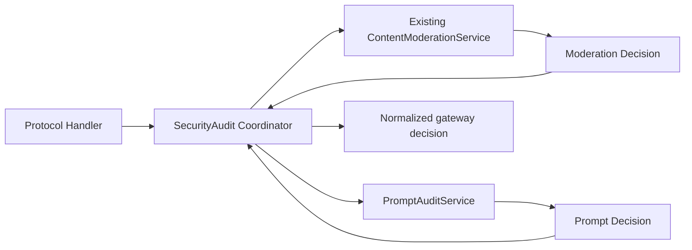

## Context

### 當前系統

sub2api 當前已經存在一套完整的內容稽核能力：

- 核心實現位於 `backend/internal/service/content_moderation*.go`。
- 管理 API 位於 `backend/internal/handler/admin/content_moderation_handler.go`，路由字首為 `/admin/risk-control`。
- 閘道器統一接線位於 `backend/internal/handler/content_moderation_helper.go`，各協議 Handler 在解析完請求體和模型後呼叫 `checkContentModeration`。
- 資料儲存在 `content_moderation_logs`，配置儲存在 settings 的 `content_moderation_config`。
- 管理頁面為 `frontend/src/views/admin/RiskControlView.vue`。
- 能力包括 OpenAI Moderations、關鍵詞阻斷、命中 Hash、非同步觀察、同步前置阻斷、API Key 健康、郵件、違規計數和自動封號。

該能力不是本次要遷移的 aicodex-api “提示詞審計”：兩者使用不同模型、分類、佇列、事件和阻斷語義。把 Qwen3Guard 直接塞入 ContentModerationService 會讓現有閾值、封號統計和記錄含義失真，也會繼續擴大已經接近 3000 行的單檔案。

### 參考能力

參考倉庫 `/Users/mt/code/mt-ai/aicodex/aicodex-api` 當前磁碟實現提供：

- OpenAI 相容 Qwen3Guard 審計池。
- 持久 PromptAuditJob / PromptAuditEvent。
- Redis 30 分鐘臨時原文載荷。
- 程式內 Worker、重試、租約和滯留回收。
- 脫敏快照、Hash、Unicode 分片、最新輸入優先。
- 九類風險和嚴格 `Safety/Categories` 解析。
- 非同步審計與同步 fail-closed 阻斷。
- HTTP、SSE、Responses WebSocket 錯誤對映。
- 節點探測、執行態、事件篩選/詳情/硬刪除和獨立控制台頁面。

參考倉庫 `yjb` 分支當前包含未提交的同步阻止改動。因此實施開始前必須固定源 commit/tag 或生成包含未提交檔案的只讀 patch 清單，作為功能對照和測試移植的權威基線。

### 目標專案約束

- PostgreSQL SQL migrations 是 schema 的事實源，Ent 自動遷移不是生產建表入口。
- 後端是 Go + Gin + Wire；前端是 Vue 3 + TypeScript + pnpm。
- Redis 已是執行基礎設施，可作為短 TTL 敏感載荷儲存和配置失效通知通道。
- 新模組必須儘量集中在獨立目錄，並只通過顯式介面接入現有 Handler。
- 新功能預設關閉，不能改變升級前行為。
- 完整提示詞和 Guard 憑據不能進入資料庫、日誌、API、前端或錯誤響應。

### 參與邊界

- 閘道器請求處理：提供可信身份上下文、協議、模型和原始請求體。
- 安全審計協調器：呼叫兩個獨立引擎並歸併阻斷結果。
- 現有內容稽核：保持原實現和副作用。
- 新 Prompt Audit 模組：負責配置、提取、佇列、Guard、事件、執行態和管理 API。
- PostgreSQL：持久任務與事件。
- Redis：掃描正文 TTL、配置失效通知、可選跨例項心跳/指標彙總。
- 控制台：獨立提示詞審計頁面。

## Goals / Non-Goals

**Goals:**

- 在不改變現有內容稽核語義的前提下完整引入提示詞輸入審計。
- 使用模組化垂直目錄封裝新能力，限制對現有程式碼的修改面。
- 保持所有現有 OpenAI/Claude/Gemini/媒體相容入口的請求和響應 envelope。
- 提供非同步不阻塞和同步 fail-closed 兩種模式。
- 在同步 Block/Unavailable 時保證無帳號、無計費、無上游副作用。
- 支援多例項持久任務消費和配置最終一致。
- 只持久化脫敏、可關聯、可複核的資料。
- 把執行態、日誌、指標和測試設計為第一等反饋訊號。
- 提供完整、獨立、可訪問的管理頁面。

**Non-Goals:**

- 不稽核模型輸出，不在流式輸出中途截斷。
- 不實現請求正文 Redact 或自動改寫。
- 不實現人工審批、申訴、逐請求放行或策略工作流。
- 不把 Qwen3Guard 分類對映為現有 OpenAI Moderations 分數。
- 不讓提示詞審計命中觸發自動封號、郵件或 Hash 黑名單。
- 不刪除、合併或遷移 `content_moderation_logs`。
- 不新增目標專案不存在的 AICodex 專屬產品路由；只對目標專案實際存在的文本入口提供等價覆蓋。
- 不在本 change 中重構整個 Handler、計費或帳號排程架構。

## Decisions

### 1. 遷移行為契約，而不是直接複製源目錄

源模組依賴 aicodex-api 的 Ent 全域性客戶端、option 模型、Gin context key、日誌封裝、Caddy/gatewaycore 和 React 控制台，不能原樣複製到目標專案。

實施時以本 change 的 specs 和驗收矩陣作為權威行為契約，再選擇目標專案已有的 SettingRepository、Redis、SecretEncryptor、Gin Handler、SQL migration 和 Vue 元件實現。

**備選方案：直接複製 `internal/service/promptaudit`。** 放棄，因為會引入大量適配殼、全域性狀態和源倉庫私有依賴，並且源工作區當前未提交。

### 2. 使用模組化垂直目錄承載新能力

新增目錄：

```text
backend/internal/securityaudit/
├── coordinator.go
├── prompt_config.go
├── prompt_types.go
├── prompt_snapshot.go
├── prompt_scanner.go
├── prompt_qwen3guard.go
├── prompt_outbound_security.go
├── prompt_repository.go
├── prompt_payload_store.go
├── prompt_enqueue.go
├── prompt_worker.go
├── prompt_guard.go
├── prompt_runtime.go
├── prompt_handler.go
├── prompt_logging.go
├── prompt_module.go
└── *_test.go
```

該目錄內部允許用檔案劃分子職責，但對外只暴露：

- `Coordinator.Check(ctx, Request) Decision`
- `PromptService` 生命週期與管理方法
- `PromptAdminHandler`
- Wire provider set

SQL migration、前端和少量路由/注入接線由於專案結構約束仍位於各自事實源目錄。

**備選方案：繼續平鋪在 `internal/service`、`internal/repository` 和 `internal/handler`。** 放棄，因為無法滿足獨立模組要求，也會增加 AI 和人工定位所需上下文。

### 3. 使用薄協調器組合兩個引擎

目標呼叫關係：



Coordinator 只承擔：

1. 接收可信身份和請求快照。
2. 確保新非同步任務即使現有引擎隨後阻斷也能 best-effort 投遞。
3. 在新同步模式下執行兩個引擎並等待結果。
4. 使用固定優先順序生成客戶端決策。

優先順序：

1. 現有內容稽核 Block：保留原狀態、錯誤碼和文案。
2. Prompt Guard Block：403 + `prompt_guard_blocked`。
3. Prompt Guard Invalid：503 + `prompt_guard_invalid_response`。
4. Prompt Guard Unavailable：503 + `prompt_guard_unavailable`。
5. 否則 Allow。

兩個引擎的事件和副作用獨立。Coordinator 不持久化業務事件，不修改風險分數。

**同步執行策略：** 當 Prompt Guard blocking 開啟時，現有內容稽核和 Prompt Guard 可在獨立受控 goroutine 中並行執行，共享請求取消訊號但不共享 mutable state。必須等待兩者完成或各自 deadline 到期，以保留兩個引擎的審計完整性。若實現評審認為並行引入的複雜度過高，可先序列執行，但仍必須滿足既有 Block 響應優先順序和無下游副作用測試。

### 4. 複用現有接入位置，但顯式改名為安全審計

把各協議 Handler 的 `checkContentModeration` 呼叫機械替換為 `checkSecurityAudit`，保持呼叫點仍在：

- 身份鑑權、基本請求體讀取和協議格式校驗之後。
- 帳號選擇、帳戶併發、計費資格、預扣、上游撥號/寫入之前。

現有 `content_moderation_helper.go` 改為或新增 `security_audit_helper.go`，構造統一 `securityaudit.Request`：

```go
type Request struct {
    RequestID  string
    UserID     int64
    Username   string
    UserEmail  string
    APIKeyID   int64
    APIKeyName string
    GroupID    *int64
    GroupName  string
    Provider   string
    Endpoint   string
    Protocol   string
    Model      string
    Body       []byte
    Stage      string // http, first_turn, subsequent_turn
}
```

請求體必須在 Handler 已受全域性大小限制後傳入。模組不得再次從 `http.Request.Body` 讀取，避免破壞轉發。

### 5. 保持三個獨立開關層級

有效開關：

1. `risk_control_enabled`：現有安全審計總入口和選單開關。
2. `content_moderation_config.enabled/mode`：現有內容稽核。
3. `prompt_audit_config.enabled/blocking_enabled`：新提示詞審計。

Prompt Audit 有效模式：

| risk_control | enabled | blocking_enabled | 有效行為 |
| --- | --- | --- | --- |
| false | 任意 | 任意 | off |
| true | false | false | off |
| true | true | false | async_audit |
| true | true | true | blocking |

後端必須拒絕 `enabled=false && blocking_enabled=true`。前端聯動只提升體驗，不能替代後端校驗。

### 6. 配置使用 settings JSON，但憑據獨立加密

新增 setting key：`prompt_audit_config`。

配置結構包含：

```text
enabled
blocking_enabled
store_pass_events
strategy=priority
worker_count
queue_capacity
scanners[]
all_groups
group_ids[]
config_version
updated_at
updated_by
change_summary
endpoints[]
```

每個 endpoint 持久化：

```text
id, name, protocol=openai_compatible, base_url, model,
token_ciphertext, timeout_ms, input_limit, enabled
```

讀取 API 只返回 `has_token`/`token_status`。儲存請求使用：

- `token` 非空：替換並加密。
- `token` 空且 `clear_token=false`：保留已有密文。
- `clear_token=true`：刪除密文。

config_version 每次成功儲存單調加一。change_summary 只儲存節點數量、開關、分類數量、分組數量及其 Hash 等脫敏摘要。

儲存請求必須攜帶管理員讀取草稿時的 `expected_config_version`。ConfigStore 在 PostgreSQL 短事務中獲取 `prompt_audit_config` 專用 advisory transaction lock，重新讀取 settings 當前值並比較版本；不一致時返回 409 `prompt_audit_config_conflict`，不得覆蓋其他管理員的新配置。版本一致時才計算 current+1、加密並寫回。首次無 setting 時按 version=1/default-off 參與比較。程式內 mutex 不能代替該多例項 CAS。

**備選方案：新增配置表。** 第一版放棄，因為目標專案已有 settings 配置模式，源實現也使用 option JSON；任務和事件才需要獨立關係表。

### 7. 配置使用記憶體快照和 Redis 失效通知

PromptService 維護原子只讀配置快照：

- 啟動時載入並校驗。
- 儲存成功後先安裝本例項快照，再 publish `sub2api:prompt_guard:config:invalidate`，訊息只包含版本。
- 其他例項收到通知後重新從 settings 載入、解密、校驗並原子替換。
- Redis publish 失敗時保留最後有效配置，並通過 5 秒有界 TTL 後臺重新整理。
- 請求熱路徑只讀取快照，不查詢資料庫。

執行態返回 expected 和 active version。配置載入失敗不得清空最後有效快照；冷啟動無有效快照時不得偽裝為關閉或健康。

### 8. 使用提示詞專用快照提取器，不直接複用現有截斷結果

複用現有內容稽核提供的 protocol 常量、身份/分組上下文和部分 JSON 內容塊解析思路，但新模組實現獨立 `PromptSnapshotExtractor`：

- Chat Completions：只提取 role=user 的文本內容。
- Responses：支援 input 字串、訊息陣列和 content blocks。
- Claude Messages：提取 role=user 文本塊。
- Gemini：提取 user contents/parts 文本。
- Images/媒體：只提取 prompt 文本，忽略圖片載荷。
- Responses WS：解析每個 response.create 幀。

掃描順序：

1. 最新非空使用者輸入獨立作為首段。
2. 其餘使用者歷史保持確定順序。
3. 每段再按 Unicode rune 分片。

資料庫預覽使用統一脫敏器：移除/掩碼 API Key、Bearer、常見憑據、郵箱/電話等敏感模式，隨後按 rune 裁剪。Hash 使用實際待掃描文本的 SHA-256。

### 9. PostgreSQL 使用兩個新表，SQL migration 為事實源

建議 migration 名稱：`backend/migrations/181_prompt_audit.sql`。如果實施時已有 181，則按當前最大序號遞增，不允許修改已應用 migration。

#### `prompt_audit_jobs`

```sql
CREATE TABLE prompt_audit_jobs (
    id                    BIGSERIAL PRIMARY KEY,
    request_id            VARCHAR(128) NOT NULL DEFAULT '',
    user_id               BIGINT REFERENCES users(id) ON DELETE SET NULL,
    username_snapshot     VARCHAR(255) NOT NULL DEFAULT '',
    user_email_snapshot   VARCHAR(320) NOT NULL DEFAULT '',
    api_key_id            BIGINT REFERENCES api_keys(id) ON DELETE SET NULL,
    api_key_name_snapshot VARCHAR(255) NOT NULL DEFAULT '',
    group_id              BIGINT REFERENCES groups(id) ON DELETE SET NULL,
    group_name            VARCHAR(255) NOT NULL DEFAULT '',
    provider              VARCHAR(64) NOT NULL DEFAULT '',
    endpoint              VARCHAR(128) NOT NULL DEFAULT '',
    protocol              VARCHAR(64) NOT NULL DEFAULT '',
    model                 VARCHAR(255) NOT NULL DEFAULT '',
    prompt_hash           VARCHAR(64) NOT NULL DEFAULT '',
    redacted_preview      TEXT NOT NULL DEFAULT '',
    prompt_length         INT NOT NULL DEFAULT 0,
    message_count         INT NOT NULL DEFAULT 0,
    execution_mode        VARCHAR(32) NOT NULL DEFAULT 'async_audit',
    config_version        BIGINT NOT NULL DEFAULT 1,
    status                VARCHAR(32) NOT NULL DEFAULT 'staging',
    attempts              INT NOT NULL DEFAULT 0,
    max_attempts          INT NOT NULL DEFAULT 3,
    claim_version         BIGINT NOT NULL DEFAULT 0,
    next_attempt_at       TIMESTAMPTZ NOT NULL DEFAULT NOW(),
    processing_started_at TIMESTAMPTZ,
    processed_at          TIMESTAMPTZ,
    last_error_code       VARCHAR(64) NOT NULL DEFAULT '',
    last_error_message    TEXT NOT NULL DEFAULT '',
    created_at            TIMESTAMPTZ NOT NULL DEFAULT NOW(),
    updated_at            TIMESTAMPTZ NOT NULL DEFAULT NOW()
);
```

狀態集合：`staging|queued|processing|retry|done|failed`。

關鍵索引：

```text
(status, next_attempt_at, id)
(request_id)
(user_id, created_at DESC)
(api_key_id, created_at DESC)
(group_id, created_at DESC)
(prompt_hash)
(created_at DESC)
```

#### `prompt_audit_events`

```sql
CREATE TABLE prompt_audit_events (
    id                       BIGSERIAL PRIMARY KEY,
    job_id                   BIGINT NOT NULL REFERENCES prompt_audit_jobs(id) ON DELETE CASCADE,
    request_id               VARCHAR(128) NOT NULL DEFAULT '',
    user_id                  BIGINT REFERENCES users(id) ON DELETE SET NULL,
    username_snapshot        VARCHAR(255) NOT NULL DEFAULT '',
    user_email_snapshot      VARCHAR(320) NOT NULL DEFAULT '',
    api_key_id               BIGINT REFERENCES api_keys(id) ON DELETE SET NULL,
    api_key_name_snapshot    VARCHAR(255) NOT NULL DEFAULT '',
    group_id                 BIGINT REFERENCES groups(id) ON DELETE SET NULL,
    group_name               VARCHAR(255) NOT NULL DEFAULT '',
    provider                 VARCHAR(64) NOT NULL DEFAULT '',
    endpoint                 VARCHAR(128) NOT NULL DEFAULT '',
    protocol                 VARCHAR(64) NOT NULL DEFAULT '',
    model                    VARCHAR(255) NOT NULL DEFAULT '',
    prompt_hash              VARCHAR(64) NOT NULL DEFAULT '',
    redacted_preview         TEXT NOT NULL DEFAULT '',
    decision                 VARCHAR(32) NOT NULL DEFAULT 'pass',
    risk_level               VARCHAR(32) NOT NULL DEFAULT 'low',
    action                   VARCHAR(32) NOT NULL DEFAULT 'Allow',
    categories               JSONB NOT NULL DEFAULT '[]'::jsonb,
    matched_scanners         JSONB NOT NULL DEFAULT '[]'::jsonb,
    scanner_scores           JSONB NOT NULL DEFAULT '{}'::jsonb,
    scanner_evidence         JSONB NOT NULL DEFAULT '{}'::jsonb,
    scanner_backend          VARCHAR(64) NOT NULL DEFAULT 'qwen3guard-openai',
    scanner_version          VARCHAR(128) NOT NULL DEFAULT '',
    guard_endpoint_id        VARCHAR(128) NOT NULL DEFAULT '',
    policy_id                VARCHAR(128) NOT NULL DEFAULT '',
    policy_version           INT NOT NULL DEFAULT 0,
    config_version           BIGINT NOT NULL DEFAULT 1,
    chunk_total              INT NOT NULL DEFAULT 0,
    latency_ms               INT NOT NULL DEFAULT 0,
    created_at               TIMESTAMPTZ NOT NULL DEFAULT NOW()
);
```

事件保留請求快照列用於穩定查詢，即使 user/API key/group 後續刪除仍保留管理員可複核上下文。使用者名稱、郵箱和 API Key 名稱必須作為不同欄位返回，不能拼成不可篩選的單一展示串；這些身份快照沿用現有管理員資料訪問和保留規則，不得寫入普通請求日誌。外部索引鍵使用 SET NULL，快照欄位保留。

事件索引：job、request、decision/time、risk/time、user/time、API key/time、group/time、Hash、created_at。

不得建立 raw_prompt、raw_request、payload、token 等列。

### 10. 跨 PostgreSQL/Redis 投遞使用 staging 狀態避免競態

非同步投遞順序：

1. 檢查有效模式、範圍和節點；在 PostgreSQL 短事務內獲取 Prompt Audit 佇列准入 advisory transaction lock，重新統計 active jobs，並僅在低於 snapshot queue_capacity 時插入 staging job。
2. 提取快照。
3. 插入 `status=staging` 的 job。
4. `SET sub2api:prompt_audit:payload:<job_id> <scan_text> EX 1800`。
5. 條件更新 staging → queued。
6. 輸出 `prompt_audit.job_enqueued`。

Worker 只領取 queued/retry，因此不會在 Redis SET 前看到任務。

失敗處理：

- 步驟 3 失敗：不寫 Redis。
- 步驟 4 失敗：job → failed，原請求繼續。
- 步驟 5 失敗：刪除 Redis key；job 由 staging 清理器標記 failed。
- 程式在 4/5 之間退出：Redis 自動過期，staging 回收器標記 failed。

這比源實現“先 queued 再寫 Redis”更適合多例項，避免 Worker 提前領取。

佇列容量檢查和 staging INSERT 必須在同一准入鎖事務中完成，防止多個例項先各自看到剩餘容量再共同超限。鎖等待必須有很短的有界 timeout；無法及時取得鎖時按 `queue_admission_busy` 丟棄非同步審計任務並讓主請求繼續。Redis 寫入不在該事務內。

### 11. Worker 使用 PostgreSQL 原子領取與租約

Repository 使用短事務：

```sql
WITH candidate AS (
    SELECT id
    FROM prompt_audit_jobs
    WHERE status IN ('queued', 'retry')
      AND next_attempt_at <= NOW()
    ORDER BY next_attempt_at, id
    FOR UPDATE SKIP LOCKED
    LIMIT 1
)
UPDATE prompt_audit_jobs j
SET status = 'processing',
    attempts = attempts + 1,
    claim_version = claim_version + 1,
    processing_started_at = NOW(),
    updated_at = NOW()
FROM candidate
WHERE j.id = candidate.id
RETURNING j.*;
```

Worker 必須把 RETURNING 得到的 `claim_version` 作為 fencing token 儲存到本次執行上下文。每處理一個分片前以 `id + status=processing + claim_version` 條件更新 `processing_started_at`；建立事件、標記 done/retry/failed 同樣必須校驗 claim_version 並檢查 affected rows。回收後再次領取會遞增版本，因此舊 Worker 即使稍後恢復也不能覆蓋新領取者的結果。

回收器每分鐘掃描一小批超時 processing：

- attempts < max_attempts → retry。
- attempts >= max_attempts → failed。

退避建議：5s、30s、2m，上限 5m並加少量 jitter。401/403 和 invalid_response 不重試；429、5xx、連線錯誤和超時可重試。

Runner 生命週期由應用啟動/停止管理：

- Start 驗證 DB、Redis、配置。
- Worker panic 單任務恢復並記錄，不能殺死程式。
- Shutdown 停止領取新任務，等待活動任務到有界超時。

### 12. OpenAI 相容 Client 使用嚴格 Qwen3Guard 契約

請求：

```json
{
  "model": "sileader/qwen3guard:0.6b",
  "messages": [{"role": "user", "content": "<chunk>"}],
  "temperature": 0,
  "max_tokens": 64,
  "seed": 42
}
```

解析要求：

- 響應體上限 256 KiB。
- 只接受一個非空 `Safety:` 行和一個 `Categories:` 行。
- 只接受 Safe、Controversial、Unsafe。
- 不允許額外非空說明。
- 類別做大小寫/標點別名歸一，但未知類別必須保留風險事實。

策略對映：

| Safety | 已啟用類別 | 結果 |
| --- | --- | --- |
| Safe | 任意 | Pass / Allow |
| Controversial | 普通類別 | Flag / Warn |
| Controversial | Jailbreak/PII/Suicide & Self-Harm | Critical / Block |
| Unsafe | 至少一個啟用類別 | Critical / Block |
| Unsafe | 未知類別 | Critical / Block + unknown_unsafe |
| Unsafe | 僅命中明確停用類別 | Flag / Warn，保留事實 |

scanner score 只用於展示排序，不得被解釋為真實置信度閾值。

管理 API 還應從 categories、scanner evidence 和 Guard policy 確定性派生 `issue_summaries`。每項至少包含 category、scanner_id、title、description、severity/label、action/label、code、score 和脫敏 evidence；可選位置必須是 rune 範圍和不可逆命中 Hash，不能返回原文。該摘要是展示 DTO，不要求新增資料庫列，防止複製同一風險事實。

### 13. 同步 Guard 使用共享 deadline、故障切換和 bulkhead

同步 evaluator：

- 全域性併發上限預設 64。
- 每節點併發上限預設 16。
- 總 deadline 使用第一啟用節點 timeout。
- 所有分片和節點故障切換共享 deadline。
- 順序掃描，最新輸入優先。
- Block 可早停；Allow 必須所有必要分片成功。
- 連線失敗、429、5xx、超時可切下一節點。
- 401/403、invalid_response 終止。
- 所有節點失敗或 bulkhead 滿 → Unavailable。

第一版不使用熔斷器外部依賴；連續失敗健康狀態和凍結視窗可用模組內小狀態機實現。若後續資料證明需要通用熔斷庫，另起 change。

### 14. 出站 HTTP Client 使用管理員配置的網路目標

儲存、探測和實際呼叫共用同一校驗：

- 僅接受結構有效的 http/https Base URL，並禁止會破壞固定 API 路徑拼接的 userinfo、query、fragment。
- 私網、迴環、link-local、metadata、保留地址及域名解析結果均不做目標類別攔截。
- HTTP 與 HTTPS 均可由管理員選擇；使用標準 DialContext 和標準重定向行為。
- 節點目標的可信性、網路可達性和協議安全由管理員負責。
- 獨立連線池、Dial/TLS/Header timeout、響應上限。
- 日誌只記錄 endpoint ID，不記錄完整 URL。

### 15. HTTP、SSE 和 WebSocket 使用協議原有錯誤建構子

HTTP 錯誤：

| 情況 | HTTP | error_code |
| --- | ---: | --- |
| Block | 403 | prompt_guard_blocked |
| Unavailable | 503 | prompt_guard_unavailable |
| Invalid response | 503 | prompt_guard_invalid_response |

Handler 使用自己已有的 OpenAI、Claude 或 Gemini error helper。正文只包含通用中文訊息、code 和 request ID。

現有 helper 需要通過最小協議介面卡擴充套件穩定程式碼，不能破壞原欄位：

- OpenAI Chat/Responses：保持 `error.type/message` 或 Responses 現有結構，並設定 `error.code=<prompt_guard_*>`。
- Claude Messages：保持 `type=error` 和合法的 `error.type=permission_error|api_error`，增加可選 `error.code=<prompt_guard_*>`。
- Gemini：保持 Google envelope 的數值 `error.code`、message 和 canonical status；在 `error.details[]` 增加 `type.googleapis.com/google.rpc.ErrorInfo`，其 `reason=<prompt_guard_*>`、domain=`sub2api.securityaudit`，metadata 只允許 request_id。

不得把 Gemini 數值 `error.code` 替換為字串，也不得把類別、Prompt、節點或內部錯誤放入 details。協議 golden test 必須鎖定三類 envelope。

SSE 必須在 Guard 完成前不寫 response header/首位元組。

Responses WebSocket：

- 握手本身無 prompt，不執行輸入分類。
- 首個 response.create 在使用者/帳號 slot、計費和上游撥號前檢查。
- 每個後續 response.create 在本輪 slot、計費和上游傳送前重新檢查。
- Block：close 4403，reason prompt_guard_blocked。
- Unavailable/Invalid：close 1013，對應穩定 reason。
- 日誌 stage=first_turn/subsequent_turn。

### 16. 同步結果採用獨立輕量記錄路徑

同步 evaluator 返回：

```text
decision, action, risk_level, categories,
matched_scanners, scores, evidence,
scanner_backend/version, endpoint_id,
policy_id/version, chunk_total, latency,
error_code, allow_next_stage
```

記錄 adapter：

- 不接受完整 scan_text，只接受脫敏 PromptSnapshot。
- 建立 `execution_mode=blocking,status=done` 的 job。
- 按 store_pass_events 決定是否建立事件。
- 在單個 DB transaction 內完成 job + event。
- 記錄失敗只增加指標和日誌，不改變 evaluator 已確定結果。
- 禁止再次呼叫 Guard。

### 17. 管理 API 使用獨立字首和現有管理員審計

新增：

```text
GET    /admin/prompt-audit/config
PUT    /admin/prompt-audit/config
POST   /admin/prompt-audit/endpoints/probe
GET    /admin/prompt-audit/runtime
GET    /admin/prompt-audit/events
GET    /admin/prompt-audit/events/:id
DELETE /admin/prompt-audit/events/:id
POST   /admin/prompt-audit/events/batch-delete
POST   /admin/prompt-audit/events/delete-preview
POST   /admin/prompt-audit/events/delete-by-filter
```

所有寫操作和敏感探測複用 AdminAuth 和現有管理操作審計。審計 detail 採用 allowlist 欄位，不使用“先記錄完整結構再刪除敏感 key”的方式。

刪除規則：

- 單次批次 ID 數量有上限。
- 按篩選刪除必須帶開始/結束時間、預覽 Hash、服務端認證 confirmation_token 和 confirm。
- preview 在同一資料庫快照中返回 matched_count、`snapshot_max_id` 和 `filter_hash = SHA-256(canonical JSON filter summary + snapshot_max_id)`。
- confirmation_token 是由現有 SecretEncryptor 認證加密的短期 claim，繫結 filter_hash、snapshot_max_id、管理員 ID、簽發/過期時間（預設 5 分鐘）。delete-by-filter 必須解密、校驗操作者/過期時間/Hash，並強制 `id <= snapshot_max_id`；客戶端自行計算 SHA-256 不能繞過預覽，預覽後的新事件不能被本次操作刪除。
- 刪除分批執行，避免長事務。
- 刪除事件後只刪除無任何事件引用且非 processing 的孤立 job。
- 嘗試清理對應 Redis key。

### 18. 控制台使用獨立 feature 目錄

```text
frontend/src/features/prompt-audit/
├── PromptAuditView.vue
├── api.ts
├── types.ts
├── viewModel.ts
├── components/
└── __tests__/
```

少量外部接線：

- router 增加 `/admin/prompt-audit`，複用 requiresAuth/requiresAdmin/requiresRiskControl。
- Sidebar 把現有 risk-control 單項改為 expandOnly “安全審計”分組，子項保留原路由並新增提示詞路由。
- i18n 增加 zh/en 對稱鍵。

頁面分割槽：

1. 執行概覽。
2. 審計池表格和引數/探測對話方塊。
3. 分組範圍和九類 scanner。
4. Worker/佇列/配置版本/Guard 指標。
5. 事件篩選、表格、詳情、刪除。
6. 固定儲存欄：enabled、blocking、store pass、儲存/重置。

頁面不得在 localStorage/sessionStorage 儲存 API Key。儲存成功後立即清除輸入 state。

### 19. 日誌和指標使用穩定詞典

最小事件：

```text
prompt_audit.config_updated
prompt_guard.config_loaded
prompt_guard.config_reload_degraded
prompt_audit.endpoint_probe_started
prompt_audit.endpoint_probe_finished
prompt_audit.endpoint_probe_failed
prompt_audit.job_enqueued
prompt_audit.enqueue_skipped
prompt_audit.enqueue_dropped
prompt_audit.started
prompt_audit.processing_reclaimed
prompt_audit.processed
prompt_audit.process_failed
prompt_audit.finding_recorded
prompt_audit.scan_chunk_started
prompt_audit.scan_chunk_completed
prompt_audit.scan_chunk_failed
prompt_audit.scan_chunks_aggregated
prompt_guard.evaluation_started
prompt_guard.allowed
prompt_guard.blocked
prompt_guard.failed
prompt_guard.result_record_failed
prompt_audit.event_deleted
prompt_audit.events_deleted
prompt_audit.events_delete_previewed
prompt_audit.events_filter_deleted
```

欄位採用 allowlist：request_id、user_id、api_key_id、group_id、provider、protocol、endpoint、model、job_id、event_id、config_version、guard_endpoint_id、decision、risk_level、action、chunk_index、chunk_total、chunk_chars、input_chars、input_limit、latency_ms、status、error_code、error_kind、queue_length/capacity、stage、upstream_dispatched、billing_preconsumed。

禁止：body、raw_prompt、payload、token、authorization、完整 Base URL/query、Redis value。

指標：非同步 enqueue/dropped、佇列各狀態、processed/failed、Worker active、Guard total/allow/flag/block/unavailable/invalid/timeout/failover/bulkhead/record_failure、延遲直方圖。Guard 結果與延遲由同步 evaluator 和非同步 Worker 使用同一穩定指標結構觀測，使 blocking 啟用前可以先在 async 測試分組建立 P50/P95/P99、失敗率和事件增長率基線；runtime 同時返回 async enqueue/dropped 計數以區分投遞與掃描階段。

### 20. 測試按行為矩陣而不是檔案覆蓋率驗收

核心矩陣：

| 維度 | 值 |
| --- | --- |
| 引擎 | 現有 moderation / prompt audit / 兩者 |
| Prompt 模式 | off / async / blocking |
| 協議 | chat / responses / messages / gemini / images-media / responses-ws |
| 返回 | allow / flag / block / unavailable / invalid |
| 流式 | non-stream / SSE / WS first / WS subsequent |
| 副作用 | account selection / billing / upstream |

必須有結構測試驗證所有現有呼叫點經過 Coordinator；必須有 stub 統計 Block/Unavailable 時帳號選擇、計費和上游呼叫均為 0。

敏感資訊測試對日誌、DB row、API JSON、前端 state snapshot 做 canary secret 斷言。

### 21. 不新增外部執行時依賴

使用現有 go-redis、database/sql、Gin、SecretEncryptor、logger、Vue 3、Axios 和測試工具。Qwen3Guard 是外部 OpenAI 相容服務，不在本倉庫啟動模型程式。

不引入新的 Go 佇列庫、ORM、前端狀態庫或 UI 框架。

## Risks / Trade-offs

- [兩個同步引擎會增加首位元組延遲] → 只有管理員顯式開啟 blocking 才發生；並行執行、最新輸入優先、Block 早停、共享 deadline、連線池和分組灰度。
- [Guard 故障在 fail-closed 下影響可用性] → 多節點有序故障切換、bulkhead、真實探測、執行態告警和一鍵關閉 blocking；Unavailable 與 Block 使用不同錯誤碼。
- [Qwen3Guard 誤報導致合法請求被拒絕] → 先執行 async 建立誤報基線，再按 group 灰度 blocking；保留獨立事件，不直接觸發封號。
- [兩個引擎同時 Block 時語義衝突] → 固定現有內容稽核響應優先順序，兩個事件仍獨立記錄。
- [PostgreSQL/Redis 非事務導致懸掛狀態] → staging → Redis SET → queued 釋出協議；staging 回收和 TTL 清理。
- [多例項重複消費或舊 Worker 覆蓋新結果] → `FOR UPDATE SKIP LOCKED` 原子領取、遞增 claim_version fencing token、processing 租約和帶版本條件更新。
- [長提示詞導致超時] → Unicode 分片、總 deadline、最新輸入優先；Allow 必須完整覆蓋，禁止部分結果放行。
- [管理員配置的節點可訪問服務端可達的任意網路目標] → 產品明確由管理員負責節點目標；繼續使用加密密文、日誌/API allowlist、響應上限和 canary 洩露測試保護憑據與資料。
- [手工接入多個 Handler 造成漏路由] → 將現有呼叫統一替換為 Coordinator 並增加靜態/結構路由矩陣測試。
- [新模組仍反向侵入現有 service] → 新模組依賴現有埠；現有 ContentModerationService 不匯入新模組，Handler 僅注入 Coordinator。
- [事件量過大] → 預設不儲存 Pass，分頁索引、分批刪除；後續根據真實規模單獨設計自動保留期。
- [源參考繼續變化] → 實施前凍結源基線，本 change specs 作為目標實現最終權威。

## Migration Plan

### 階段 0：凍結和對照

1. 記錄參考倉庫 commit、branch 和 `git diff --stat`。
2. 對未提交的同步阻止檔案生成只讀 patch 或提交到專用分支。
3. 建立“源功能 → 本 change requirement → 目標測試”追蹤表。

### 階段 1：純資料和配置基礎

1. 新增 SQL migration 和 Repository 測試。
2. 新增加密配置、Public DTO、URL 校驗和 config cache。
3. 新增管理 API 的 config/probe/runtime 骨架。
4. 保持 enabled=false，不接閘道器。

### 階段 2：非同步審計

1. 實現 PromptSnapshot、脫敏、Hash 和協議提取。
2. 實現 staging 投遞、Redis Payload Store、Worker、重試和回收。
3. 實現 OpenAI 相容 Client、Qwen parser、分片聚合和事件。
4. 接入 Coordinator 的 async 分支；佇列故障不影響請求。

### 階段 3：控制台和運營閉環

1. 完成頁面、節點探測、配置、執行態和事件列表/詳情。
2. 完成單條、批次和按篩選刪除。
3. 執行前後端 lint、typecheck、unit/integration test。

### 階段 4：同步門禁

1. 實現 evaluator、bulkhead、deadline、故障切換和錯誤對映。
2. 完成 HTTP/SSE 入口接線。
3. 完成 Responses WS 首輪與後續幀接線。
4. 用副作用 stub 證明 Block/Unavailable 無帳號、無計費、無上游。

### 階段 5：灰度上線

1. 生產先保持 Prompt Audit off。
2. 開啟 async，只選測試 group，觀察 Guard 延遲、失敗、誤報和事件量。
3. 建立良性/惡意迴歸語料。
4. 僅在多節點穩定、Unavailable 率和 P99 滿足閾值後開啟 blocking。
5. 按 group 擴大範圍。

### 回滾

- 首選：關閉 blocking_enabled，立即回到 async。
- 次選：關閉 enabled，完全停止新 Prompt Audit。
- 必要時關閉 risk_control_enabled，但這也會停用現有內容稽核入口，應作為最後手段。
- 回滾不刪除表、配置或歷史事件，不回退已應用 migration。
- Worker 停止後 queued/retry 任務保留；恢復時繼續處理，或由管理員按明確策略清理。

## Resolved Decisions

1. **源基線標識**：採用 `source-freeze/` 中的只讀 tracked patch + untracked archive；base commit、SHA-256 和恢復測試已登記在 `source-baseline.md`。
2. **事件自動保留期**：第一版只提供管理員安全刪除，不增加自動保留清理；真實事件量穩定後另起 change。
3. **同步兩個引擎並行或序列**：採用受控並行；實現必須通過 race test，並保持 Legacy Block 優先順序和兩引擎獨立記錄。
4. **目標專案額外文本入口**：以實施時 `backend/internal/server/routes/gateway.go` 的自動/結構列舉為事實源；所有使用者文本入口必須接入 Coordinator 或提供不會旁路/重複掃描的測試證明。
5. **生產啟用閾值**：實現和部署驗證期間只允許 off/async；blocking 生產啟用必須滿足 `verification.md` 的建議閾值並由安全、運營和業務責任人簽字，未簽字不得生產開啟。
