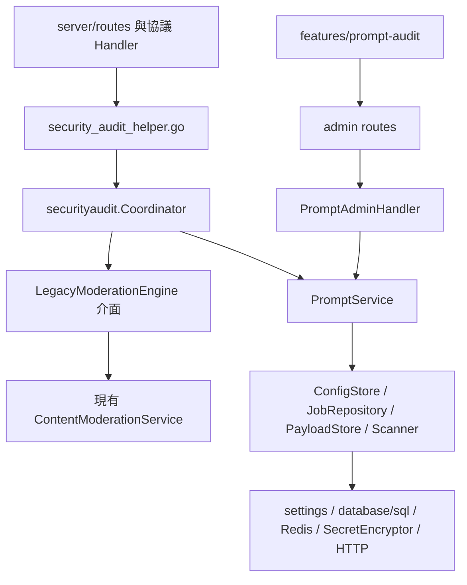
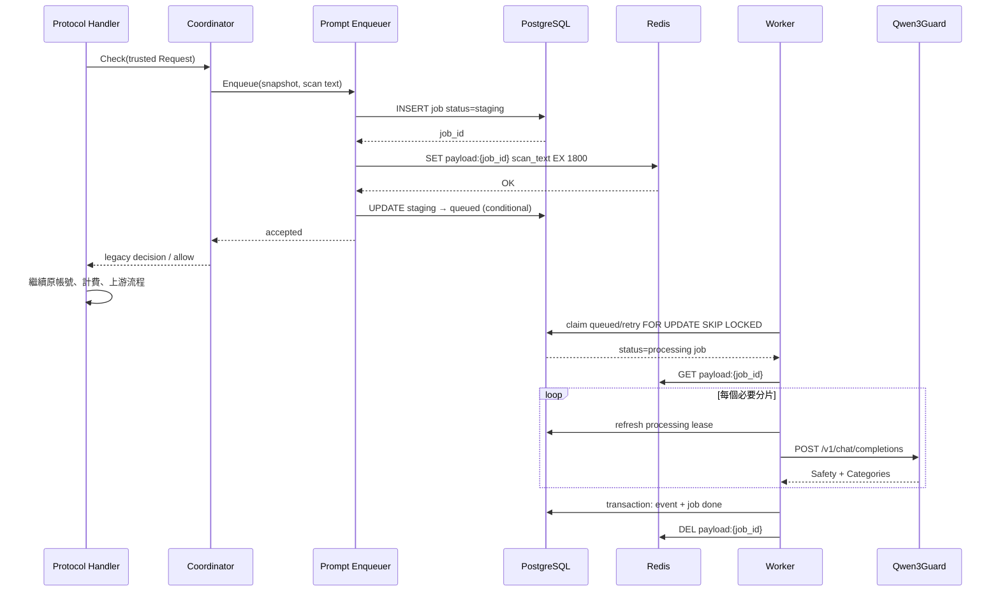
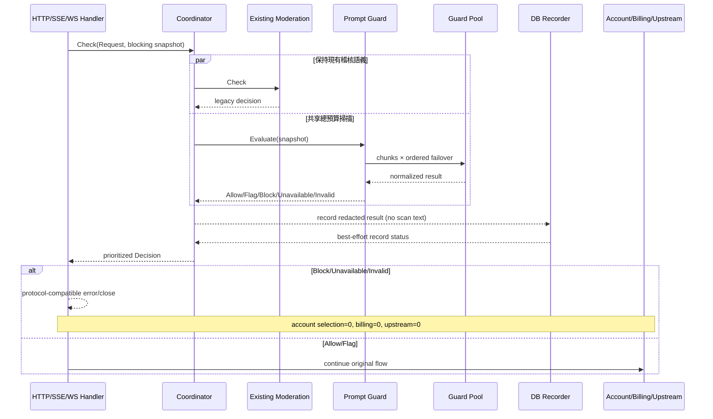
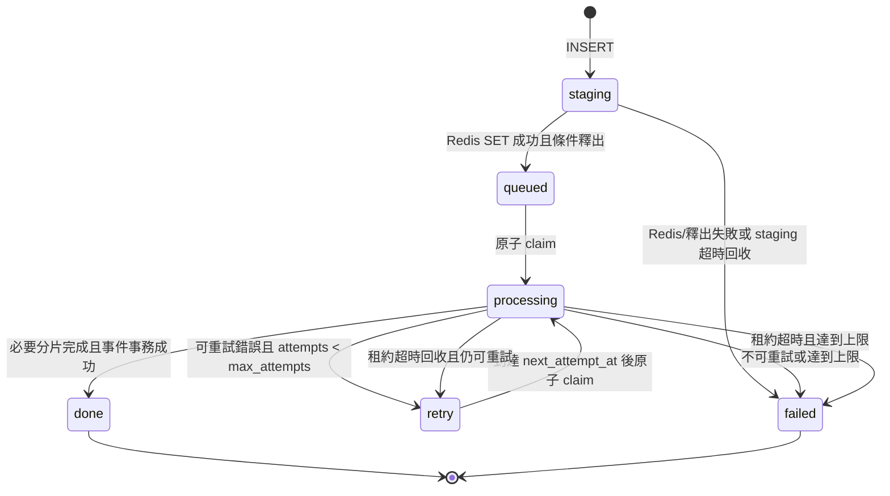

# 實施指導

## 1. 使用方式與不可變邊界

本指南把 `proposal.md`、`design.md` 和三個 delta specs 轉換為可按檔案實施、可逐階段評審的操作順序。若本指南與 specs 衝突，以 specs 為準，並先更新 OpenSpec 再編碼。

實施前必須滿足：

- `source-baseline.md` 的凍結登記已完成，不再以變化中的源工作區作為唯一依據。
- 當前內容稽核後端測試、RiskControl 前端測試和路由清單已儲存為基線證據。
- 新功能的預設配置是 off；資料庫遷移可以先上線，但不能自動開啟審計。
- `content_moderation_logs`、`ContentModerationService`、`/admin/risk-control` 和 `RiskControlView.vue` 的業務語義不改變。
- 完整 Prompt 只允許存在於請求記憶體和 Redis TTL value；Guard token 只允許存在於寫入 DTO、解密後的短生命週期記憶體和 Authorization header。

明確不做：輸出稽核、自動改寫/脫敏後轉發、人工審批、申訴、自動封號、郵件、Prompt 命中 Hash 黑名單、現有 Moderations 分類對映。

## 2. 目標依賴方向



依賴規則：

1. 現有 `internal/service` 不得 import `internal/securityaudit`；否則會把新能力反向滲入既有業務層。
2. `securityaudit` 可以通過小介面適配現有 service/repository/Redis/加密能力，但不得修改這些介面的全域性語義來遷就新模組。
3. Coordinator 只歸併客戶端決策，不寫 job/event、不傳送郵件、不封號、不更新現有 Hash。
4. Handler 只負責構造可信請求、呼叫 Coordinator、使用本協議原有錯誤 helper 返回結果。
5. 核心邏輯不得讀取 Gin context、環境變數或包級全域性配置；這些只在模組構造/Handler 邊界轉換。
6. 建構函式不得啟動 goroutine。Worker、回收器和配置訂閱必須由 `Start(ctx)` 啟動、由 `Shutdown(ctx)` 有界停止。
7. 前端只能依賴公共 DTO，不得知道 `token_ciphertext`、Redis key 或資料庫內部狀態轉換 SQL。
8. 新模組不引入新的 ORM、佇列庫、狀態庫或 UI 框架。

## 3. 建議目錄和檔案職責

```text
backend/internal/securityaudit/
├── coordinator.go                 # 雙引擎編排、固定優先順序
├── coordinator_test.go
├── prompt_types.go                # Request/Decision/Job/Event/Runtime 與列舉
├── prompt_config.go               # Storage/Public/Update DTO、校驗、快照
├── prompt_config_test.go
├── prompt_snapshot.go             # 協議提取、Hash、脫敏預覽
├── prompt_snapshot_test.go
├── prompt_scanner.go              # 分片、聚合、Scanner 介面
├── prompt_qwen3guard.go            # 請求構造、嚴格解析、九類風險
├── prompt_qwen3guard_test.go
├── prompt_issue_summary.go         # 從分類/脫敏證據派生管理端風險摘要
├── prompt_issue_summary_test.go
├── prompt_outbound_security.go     # URL/DNS/Dial/redirect/響應上限
├── prompt_outbound_security_test.go
├── prompt_repository.go            # database/sql jobs/events 實現
├── prompt_repository_test.go
├── prompt_payload_store.go         # Redis SET EX/GET/DEL
├── prompt_enqueue.go               # staging → payload → queued
├── prompt_enqueue_test.go
├── prompt_worker.go                # claim/lease/retry/reclaim/lifecycle
├── prompt_worker_test.go
├── prompt_guard.go                 # blocking evaluator、deadline/failover/bulkhead
├── prompt_guard_test.go
├── prompt_runtime.go               # 健康、版本、佇列、指標快照
├── prompt_logging.go               # 穩定事件和 allowlist fields
├── prompt_handler.go               # 獨立 admin HTTP handler
├── prompt_handler_test.go
└── prompt_module.go                # provider set、Start/Shutdown 組合

backend/migrations/181_prompt_audit.sql
backend/internal/handler/security_audit_helper.go
backend/internal/server/routes/admin.go
backend/internal/server/routes/gateway.go
backend/internal/wire/或專案實際 provider 檔案

frontend/src/features/prompt-audit/
├── PromptAuditView.vue
├── api.ts
├── types.ts
├── viewModel.ts
├── components/
└── __tests__/
```

`181` 是提案編寫時最大遷移號後的建議值。實施時若 181 已存在，必須使用新的最大序號；不得改寫已經應用的 migration。

## 4. 按檔案的實施順序

### 4.1 第一批：契約與純函式

1. 建立 `prompt_types.go`，固定穩定列舉和 JSON 欄位。
2. 建立 `prompt_config.go`，先實現預設值、三態歸一、欄位邊界和 Public DTO。
3. 建立 `prompt_snapshot.go`，完成各協議純文本提取、最新輸入優先、SHA-256 和脫敏預覽。
4. 建立 `prompt_scanner.go`、`prompt_qwen3guard.go` 與 `prompt_issue_summary.go`，完成 rune 分片、嚴格解析、聚合和展示摘要派生。
5. 同步建立上述測試；此階段不連線 DB、Redis、Gin 或真實 Guard。

驗收重點：純函式表驅動測試覆蓋中文、emoji、空輸入、混合 content blocks、九類風險、額外說明、重複欄位、未知類別和完整分片。

### 4.2 第二批：資料庫與配置適配

1. 新增 `181_prompt_audit.sql` 以及 migration schema 測試。
2. 在 `prompt_repository.go` 用現有 `*sql.DB` 實現 jobs/events；不為這兩張表增加 Ent schema。
3. 在目標專案現有 setting 常量事實源增加 `prompt_audit_config`。
4. 在 `prompt_config.go` 複用 `SettingRepository` 和 `SecretEncryptor`，實現 storage ↔ active ↔ public 三類 DTO 轉換。
5. 在 `prompt_payload_store.go` 適配現有 Redis Client。
6. 完成 Repository、加密配置、多例項版本載入測試。

### 4.3 第三批：出站安全、非同步佇列與執行態

1. `prompt_outbound_security.go` 先實現儲存/探測/呼叫共用的 URL 校驗和受控 Transport。
2. `prompt_enqueue.go` 實現 staging 釋出協議。
3. `prompt_worker.go` 實現 PostgreSQL claim、租約、重試、回收和生命週期。
4. `prompt_runtime.go` 彙總 active/expected config version、Worker、佇列、Redis 和節點健康。
5. `prompt_logging.go` 固定事件名、error_code 和允許欄位。
6. 用 fake clock、fake scanner、真實測試 PostgreSQL/Redis 分層驗證，先不開閘道器。

### 4.4 第四批：管理 API 和控制台

1. `prompt_handler.go` 註冊 config/probe/runtime/events/delete 方法。
2. 在 admin handler 聚合結構和 Wire 中注入 `PromptAdminHandler`。
3. 在 `admin.go` 註冊獨立 `/admin/prompt-audit` 路由組。
4. 建立前端 `features/prompt-audit` 的 types、api、viewModel，再建立頁面和元件。
5. 增加 router、Sidebar、zh/en i18n 的薄接線。
6. 管理閉環通過後，Prompt Audit 仍預設 off。

### 4.5 第五批：Coordinator 與非同步接入

1. 在 `coordinator.go` 用 fake engines 完成 off/async/blocking 組合測試。
2. 新增 `security_audit_helper.go`，從現有 `buildContentModerationInput` 的可信欄位構造 `securityaudit.Request`。
3. 機械替換所有現有 `checkContentModeration` 呼叫點為 `checkSecurityAudit`，保留原位置。
4. async 模式只 best-effort 投遞；Redis/DB/節點失敗不得改變客戶端響應或上游次數。
5. 執行路由結構測試，證明沒有漏掉已有呼叫點。

### 4.6 第六批：同步 Guard

1. `prompt_guard.go` 實現共享 deadline、節點優先順序、故障切換和 bulkhead。
2. Coordinator 接入 blocking 分支並固定現有內容稽核 Block 響應優先順序。
3. HTTP/SSE 使用協議原有錯誤建構子；Guard 完成前 SSE 不寫首位元組。
4. Responses WS 首輪和後續 `response.create` 分別接入，使用指定 close code。
5. 加入帳號選擇、併發 slot、預扣/計費、上游撥號/寫入 fake counter，斷言拒絕時全部為 0。

## 5. 公共核心型別建議

### 5.1 可信請求

```go
type Request struct {
    RequestID  string
    UserID     int64
    Username   string
    UserEmail  string
    APIKeyID   int64
    APIKeyName string
    GroupID    *int64
    GroupName  string
    Provider   string
    Endpoint   string
    Protocol   string
    Model      string
    Body       []byte
    Stage      string // http | first_turn | subsequent_turn
}
```

Body 必須是 Handler 在全域性 body limit 下已經讀取的同一位元組切片。模組不得再次讀 `http.Request.Body`，不得改寫轉發 body。`Username`、`UserEmail` 和 `APIKeyName` 只用於管理員事件快照/展示，不得進入普通請求日誌；API 必須分列返回，避免複製/篩選時含義混淆。

### 5.2 統一決策

```go
type Decision struct {
    Kind           string // allow | flag | block | unavailable | invalid
    HTTPStatus     int
    ErrorCode      string
    ClientMessage  string
    Legacy         *LegacyDecision
    Prompt         *PromptDecision
    AllowNextStage bool
}
```

穩定優先順序：

1. Legacy content moderation Block：完全複用原狀態碼、文案和 `content_policy_violation`。
2. Prompt Block：403 + `prompt_guard_blocked`。
3. Prompt Invalid：503 + `prompt_guard_invalid_response`。
4. Prompt Unavailable：503 + `prompt_guard_unavailable`。
5. 其他：Allow；Flag 只記錄，不阻斷。

不要讓 Coordinator 暴露 Qwen 原始響應，也不要用一個布林 `Blocked` 吞掉 unavailable/invalid 的差異。

## 6. Coordinator 請求流

```text
鑑權與 body/model 基礎校驗
  → 構造可信 Request
  → 讀取 risk_control + prompt active snapshot
  → Coordinator 呼叫現有 Moderation 與 Prompt 引擎
  → 按固定優先順序得到 Decision
  → 若 !AllowNextStage，使用當前協議 error helper 返回
  → 否則才進入帳號選擇/併發/計費/上游
```

模式行為：

| 有效模式 | 現有 Moderation | Prompt Audit | 請求等待 Prompt | Prompt 失敗影響請求 |
| --- | --- | --- | --- | --- |
| off | 原行為 | 不執行 | 否 | 否 |
| async_audit | 原行為 | best-effort enqueue | 否 | 否 |
| blocking | 原行為 | 同步掃描並複用結果記錄 | 是 | 是，fail-closed |

async 模式下應先觸發/完成有界投遞動作，再返回 Coordinator 結果，確保現有 Moderation 隨後 Block 時 Prompt 事件仍可 best-effort 產生。投遞動作必須只有短 DB/Redis 操作，不能等待 Guard。

blocking 模式可以並行執行兩個引擎，但必須遵守：

- goroutine 數量固定且可等待，不得 fire-and-forget。
- 兩個結果都在各自 deadline 內收口，或明確取消。
- Legacy Block 的響應優先，但 Prompt 結果仍按獨立規則記錄。
- 共享只讀 Request；不得共享可變 decision buffer。

## 7. 非同步時序



異常補償：

- active count 與 staging INSERT 在 PostgreSQL advisory-lock 短事務中完成；鎖超時使用 `queue_admission_busy`，不得把 Redis 呼叫放進事務。
- staging INSERT 失敗：不寫 Redis，記錄 dropped，主請求繼續。
- Redis SET 失敗：job 條件標 failed；主請求繼續。
- staging → queued 條件更新失敗：刪除 Redis key；回收器處理殘留 staging。
- Worker 找不到 payload：按穩定 `payload_missing` 失敗，不可把預覽當原文掃描。
- event 寫入失敗：非同步 job retry 或 failed，不能產生虛假 done。
- Redis DEL 失敗：依靠 TTL，記錄脫敏警告。

## 8. 同步阻斷時序



同步記錄失敗不得反轉已確定結果。一次同步評估只呼叫 Guard 一次；記錄 adapter 禁止接收 `scan_text`，防止為了落庫再次掃描或意外持久化原文。

## 9. Job 狀態機



每次 queued/retry → processing 必須把 `claim_version` 原子加一併返回給 Worker。租約重新整理、event+done 事務和 retry/failed 更新必須使用“id + processing + claim_version”條件並檢查 affected rows；0 rows 表示租約已失效，本 Worker 必須丟棄結果。禁止僅按 status 條件更新，因為任務被回收並重新領取後 status 會再次變成 processing，舊 Worker 會誤覆蓋新結果。

## 10. 配置、Storage DTO 與 Public DTO

### 10.1 儲存結構

setting key 固定為 `prompt_audit_config`，JSON 至少包含：

```text
enabled, blocking_enabled, store_pass_events,
strategy=priority, worker_count, queue_capacity,
scanners[], all_groups, group_ids[], endpoints[],
config_version, updated_at, updated_by, change_summary
```

Endpoint storage 欄位：

```text
id, name, protocol=openai_compatible, base_url,
model=sileader/qwen3guard:0.6b,
token_ciphertext, timeout_ms, input_limit, enabled
```

### 10.2 寫入 DTO

每個 endpoint 的寫入必須區分：

- `token` 非空：校驗後加密並替換舊密文。
- `token` 空且 `clear_token=false`：保留舊密文；新 endpoint 沒有舊密文時校驗失敗。
- `clear_token=true`：清除密文；啟用的 endpoint 若必須認證則儲存失敗或明確顯示不可用。

儲存請求必須攜帶 `expected_config_version`。後端在 PostgreSQL 短事務中取得該 setting 專用 advisory transaction lock、重讀當前值並做 CAS；衝突返回 409 `prompt_audit_config_conflict`，不寫 settings、不安裝快照、不發 Redis 通知。`enabled=false && blocking_enabled=true` 必須返回穩定錯誤 `prompt_guard_requires_audit_enabled`。`strategy` 第一版只接受 `priority`。儲存時 canonicalize group IDs、scanner IDs 和 endpoint IDs，拒絕重複、空 ID、越界 worker/queue/timeout/input_limit。

### 10.3 Public DTO

GET config 和 PUT 成功響應只允許：

```text
id, name, protocol, base_url, model, timeout_ms,
input_limit, enabled, has_token, token_status
```

不得出現 `token`、`token_ciphertext`、Authorization、解密失敗原文或完整錯誤響應。後端 JSON 型別應物理分離，不能依賴 `json:"-"` 後複用內部物件。

### 10.4 活動快照

- 儲存成功後 `config_version + 1`，先安裝本例項只讀快照，再發布 Redis invalidation。
- Pub/Sub 訊息只含版本，不含配置。
- 其他例項重新從 settings 載入、解密、驗證，成功後原子替換。
- 載入失敗保留 last-known-good，並在 runtime 同時展示 expected/active version 和錯誤。
- 冷啟動無 last-known-good 且 blocking 期望啟用時必須 degraded/error，不能當作 off 放行。
- 請求熱路徑只讀記憶體快照，不查 settings/DB。

## 11. 管理 API 對映

統一字首：`/admin/prompt-audit`。全部複用現有管理員鑑權、安全中介軟體和管理操作審計。

| 方法 | 路徑 | 用途 | 關鍵約束 |
| --- | --- | --- | --- |
| GET | `/config` | 讀取公共配置 | 不回顯密文/明文 token |
| PUT | `/config` | 原子儲存完整配置 | 版本遞增、allowlist 審計 |
| POST | `/endpoints/probe` | 測試儲存或臨時憑據 | 禁重定向、SSRF 防護、結果脫敏 |
| GET | `/runtime` | 執行態與指標 | 顯示真實 degraded/error |
| GET | `/events` | 複合篩選分頁 | 穩定排序；使用者名稱/郵箱/API Key 名稱分列 |
| GET | `/events/:id` | 事件詳情 | 脫敏預覽、歸一結果和派生 issue_summaries |
| DELETE | `/events/:id` | 單條硬刪除 | 審計、孤立 job 安全清理 |
| POST | `/events/batch-delete` | 按 ID 批次刪除 | 限制 ID 數量、事務分批 |
| POST | `/events/delete-preview` | 預覽篩選刪除 | 強制起止時間，返回 count/max_id/hash/token |
| POST | `/events/delete-by-filter` | 確認篩選刪除 | confirm=true，認證 token/actor/hash，限制 id≤max_id |

分組選擇複用目標專案現有管理員 group 查詢 API，不為 Prompt Audit 複製一份分組事實源。若現有 API 不適合輕量選擇器，只新增薄的只讀適配，並在實現前回寫本表。

建議錯誤 envelope 繼續使用專案管理 API 的統一結構；業務錯誤碼穩定，內部 SQL/Redis/HTTP 錯誤不得透傳。

## 12. 閘道器 Handler 路由矩陣

下表是提案編寫時已有 `checkContentModeration` 呼叫點，實施時應機械替換並由結構測試鎖定。路由別名共享相同 Handler，因此測試必須至少覆蓋主路由與每類 alias。

| 協議/入口 | 路由 | 現有 Handler 檔案/方法 | Stage | 拒絕建構子 |
| --- | --- | --- | --- | --- |
| Anthropic Messages | `POST /v1/messages` | `gateway_handler.go: Messages` 或 `openai_gateway_handler.go: Messages` | http | Anthropic error helper |
| OpenAI Responses | `POST /v1/responses`、`/responses`、`/backend-api/codex/responses` 及 subpath | `gateway_handler_responses.go: Responses` 或 `openai_gateway_handler.go: Responses` | http | Responses/OpenAI helper |
| OpenAI Chat Completions | `POST /v1/chat/completions`、`/chat/completions` | `gateway_handler_chat_completions.go: ChatCompletions` 或 `openai_chat_completions.go: ChatCompletions` | http | Chat/OpenAI helper |
| Gemini Generate/Stream | `POST /v1beta/models/*modelAction` | `gemini_v1beta_handler.go: GeminiV1BetaModels` | http | Google error helper |
| OpenAI Images | `POST /v1/images/generations`、`/v1/images/edits` | `openai_images.go: Images` | http | OpenAI helper |
| Grok image/video 文本請求 | images/videos 路由 | `grok_media.go: handleGrokMedia` | http | OpenAI helper |
| Responses WebSocket 首輪 | `GET /v1/responses`、`/responses`、`/backend-api/codex/responses` | `openai_gateway_handler.go: ResponsesWebSocket` | first_turn | close 4403/1013 |
| Responses WebSocket 後續輪次 | 每個 `response.create` | 同上 BeforeRequest/turn callback | subsequent_turn | close 4403/1013 |

實施時還必須從 `backend/internal/server/routes/gateway.go` 列舉所有攜帶使用者文本的新增/旁路入口，重點複核：

- `/v1/images/generations/async`、`/v1/images/edits/async`。
- `/v1/images/batches` 及 batch item 的實際提交入口。
- Grok video generation/edit/extension。
- 任何不經過上述公共 Handler 的內部轉發、相容 alias 或後續新增路由。

對額外入口有兩種合法結論：接入 Coordinator；或證明它已在上游公共 Handler 處檢查且不會二次收費/二次掃描。結論和測試必須加入路由矩陣，不能靜默跳過。

接入位置不變數：鑑權、body limit、基本 JSON/model 校驗之後；帳號選擇、使用者/帳號併發 slot、訂閱/餘額預扣、usage 寫入、上游撥號和 SSE 首位元組之前。

## 13. HTTP、SSE、WebSocket 處理細節

| 情況 | HTTP/SSE | WS close | reason/code |
| --- | ---: | ---: | --- |
| Prompt Block | 403 | 4403 | `prompt_guard_blocked` |
| Guard Unavailable | 503 | 1013 | `prompt_guard_unavailable` |
| Guard Invalid response | 503 | 1013 | `prompt_guard_invalid_response` |

- HTTP/SSE 必須保留各協議 envelope，不能所有協議統一成 Gin `{"error":"..."}`。
- OpenAI Chat/Responses 在 error 物件新增穩定 `code`；Claude 保留 permission_error/api_error type 並新增可選 `code`。
- Gemini 保留數值 HTTP `error.code` 和 canonical status，只在 `google.rpc.ErrorInfo.reason` 放穩定程式碼；metadata 僅 request_id。
- SSE 在 Guard 結果前不得寫 status/header/data/comment/keepalive；否則無法返回 403/503。
- WS 握手本身沒有 Prompt，不掃描。首個 `response.create` 在任何本輪資源/上游副作用前掃描。
- 後續每個 `response.create` 重新提取本輪輸入並標記 `subsequent_turn`。
- WS close reason 長度必須在協議限制內，只使用穩定短碼；詳細內部錯誤只進脫敏指標/日誌。
- Legacy moderation 同時 Block 時，繼續使用其原錯誤/close 行為和文案。

## 14. SQL 和 Repository 注意事項

### 14.1 Migration

- PostgreSQL migration 是事實源；不要複製源倉庫的 `aicodex_` 字首。
- 表名固定 `prompt_audit_jobs`、`prompt_audit_events`。
- 所有狀態、計數和非負值加 CHECK；JSONB 加可接受型別檢查更佳。
- `events.job_id ON DELETE CASCADE`；user/api_key/group 外部索引鍵 `ON DELETE SET NULL`。
- `username_snapshot`、`user_email_snapshot`、`api_key_name_snapshot` 與 group name 快照分列保留，以免主體刪除後事件無法複核；沿用現有管理員許可權和資料保留策略。
- 不新增 raw_prompt、raw_request、request_body、payload、token、authorization、guard_response_body 等列。
- 索引名全庫唯一；先檢查 migration 事實源，避免只在開發庫檢查。

### 14.2 原子領取

`FOR UPDATE SKIP LOCKED` 必須在同一短事務中選擇並更新為 processing。事務內不要呼叫 Redis、Guard 或日誌網路 sink。每次 claim 後立即提交，長工作在事務外執行。

### 14.3 租約和重試

- attempts 在成功 claim 時遞增，而不是失敗時遞增。
- 每個必要分片前重新整理租約，並以 processing 狀態和本次 claim_version 作為條件。
- 401/403、嚴格解析錯誤不可重試；429、5xx、連線、超時可重試。
- 建議退避 5s、30s、2m，上限 5m並加小 jitter；測試使用 fake clock。
- reclaim 批次有上限並按時間/id 穩定排序，防止全表鎖和飢餓。

### 14.4 事件和任務事務

- 非同步成功：event insert 與 job done 應在單事務完成。
- 同步：建立 blocking/done job 與可選 event 在單事務完成，但失敗不改變門禁結果。
- store_pass_events=false 時仍可儲存 done job 的最小脫敏執行記錄；若最終決定不儲存 Pass job，必須回寫 schema、runtime 計數和清理規格。
- 刪除 event 後只刪除無事件引用且非 processing 的孤立 job；並 best-effort 刪除 Redis key。

### 14.5 查詢與刪除

- 列表使用引數化 SQL、白名單排序欄位和穩定 `created_at DESC, id DESC`。
- 時間過濾明確採用 UTC 儲存、API ISO-8601，並定義邊界包含性。
- delete-preview 在同一資料庫快照得到 count 和 snapshot_max_id，對 canonical JSON filter + max_id 計算 SHA-256；欄位順序、空值和時區必須規範化。
- 使用 SecretEncryptor 認證加密 `{filter_hash,snapshot_max_id,admin_id,issued_at,expires_at}`，返回預設 5 分鐘有效的 confirmation_token。
- delete-by-filter 解密並校驗 actor/expiry/hash，要求同一篩選、`confirm=true` 和強制時間範圍，查詢強制 `id <= snapshot_max_id` 後分批提交；預覽後的新事件不可被刪除。

## 15. Guard Client 和出站安全

請求固定傳送到規範化 `{base_url}/v1/chat/completions`，預設模型 `sileader/qwen3guard:0.6b`，role=user、temperature=0、max_tokens=64、seed=42。

儲存、probe 和實際掃描必須走同一校驗/Transport：

- 只允許 http/https；禁止 userinfo、query、fragment。
- 禁止 metadata、link-local、multicast、unspecified、保留地址。
- 公網強制 HTTPS；HTTP 只允許顯式受控的 localhost/私網開發場景。
- DNS 解析結果和真正 Dial 的 IP 都檢查，防 DNS rebinding。
- 不跟隨 3xx；響應體最多 256 KiB。
- 獨立連線池和 Dial/TLS/ResponseHeader timeout；所有分片/故障切換仍受外層總 deadline。
- 日誌只寫 endpoint ID、HTTP status、error_code、latency，不寫完整 URL、query、header 或原始 response body。
- 分片日誌只寫 chunk_index/total/chars、input_chars/limit、endpoint ID、action、latency 和錯誤碼，不寫 chunk 或內部優先順序分隔符。

九類 scanner ID/展示名必須穩定：Violent、Non-violent Illegal Acts、Sexual Content or Sexual Acts、PII、Suicide & Self-Harm、Unethical Acts、Politically Sensitive Topics、Copyright Violation、Jailbreak。

## 16. 前端狀態與憑據處理

建議 viewModel 分成：

```text
serverSnapshot     # 最近一次後端公共配置
draft              # 可編輯非敏感配置
endpointSecrets    # 僅當前會話內的新增/替換 token
loadState          # config/runtime/groups/events 獨立狀態
probeStateByID     # 節點探測進度和脫敏結果
eventQuery         # canonical filter + page
deletePreview      # count + max_id + filter_hash + confirmation_token + filter snapshot
issueSummaries     # 後端從事件事實派生的只讀風險展示項
```

規則：

- `endpointSecrets` 不進入 Pinia 持久化、localStorage、sessionStorage、URL、console 或錯誤追蹤 breadcrumb。
- 儲存成功後立即清空已提交 secret；失敗時可以留在記憶體草稿供使用者修正，但離開頁面/解除安裝必須清空。
- 編輯已儲存節點時 token 輸入預設空，使用 `has_token/token_status` 表示存在性。
- “清除 API Key”使用獨立明確動作設定 `clear_token=true`，不能把輸入框空值當清除。
- dirty 比較忽略後端時間戳，但包含 clear/replace 意圖；儲存返回後以 Public DTO 重建 snapshot。
- config/runtime/groups/events 獨立失敗，不能一個 500 讓整頁白屏。
- `blocking_enabled` 從 false → true 必須二次確認；關閉 enabled 同時把 draft blocking 設 false。
- 刪除預覽與 filter snapshot、snapshot_max_id、confirmation_token 繫結；任何篩選變化立即廢棄舊 filter_hash/token。
- 使用者名稱、郵箱和 API Key 名稱使用不同欄位/複製按鈕；空值顯示明確 fallback，不用郵箱冒充使用者名稱。
- IssueSummary 展示 category、title/description、severity/action、scanner、score 和脫敏 evidence，禁止從 evidence 重建命中原文。
- 窄屏表格提供可讀替代佈局，Dialog 有 focus trap/return focus，所有控制元件有中英文可訪問名稱。

## 17. PR/提交切片策略

每個階段應可單獨評審、測試和回滾，建議五組 PR：

1. **資料與核心契約**：migration、types/config/snapshot/Qwen parser、Repository 及測試；無路由接入。
2. **非同步引擎**：出站安全、Redis payload、enqueue、Worker、runtime；功能預設 off。
3. **管理閉環**：admin API、獨立頁面、路由/Sidebar/i18n；仍不啟用 blocking。
4. **Coordinator 與同步門禁**：統一接入、HTTP/SSE/WS、無副作用斷言、Legacy 迴歸。
5. **灰度與運維**：指標、告警、canary 洩露檢查、執行手冊和閾值登記。

不要在同一 PR 混入無關的 ContentModeration 重構、全域性 Handler 重寫、前端框架升級或資料庫清理。若為接線必須改現有檔案，變更應機械、薄且有前後行為測試。

## 18. 五個待確認事項的決策門

| 事項 | 預設建議 | 必須在何時確認 | 未確認時行為 |
| --- | --- | --- | --- |
| 源基線標識 | 專用 commit/tag | PR 1 前 | 不開始移植 |
| 自動保留期 | 第一版只安全刪除 | migration 凍結前 | 不加自動清理 |
| 雙引擎並行/序列 | 並行 | PR 4 前做 benchmark/race | 可先序列但保留優先順序 |
| 額外文本入口 | routes 自動列舉 | PR 4 接線前 | 結構測試失敗 |
| blocking 閾值 | 運營按 async 資料登記 | 生產 blocking 前 | 只允許 off/async |

## 19. 常見錯誤

- 直接把 Qwen3Guard 加進 `ContentModerationService`，導致配置、表和副作用混用。
- 直接複製源 Ent/React/Caddy 程式碼，形成重複基礎設施或目標專案無法維護的適配殼。
- 先把 job 設 queued 再寫 Redis，造成 Worker 搶到無 payload 任務。
- 把 `redacted_preview` 當作可重試掃描正文；這會產生錯誤分類且破壞完整覆蓋。
- 用 byte 長度切中文/emoji，或只掃描第一片後返回 Allow。
- 把 Guard 401/403/invalid_response 當 Safe 或無限切節點。
- SSE 已寫 200/首位元組後才執行 Guard。
- WS 只檢查首輪，不檢查後續 `response.create`。
- Prompt 拒絕發生在帳號選擇、併發 slot、預扣或上游撥號之後。
- Public DTO 複用 Storage DTO，靠前端“不顯示”隱藏 token。
- 日誌記錄請求 body、Guard 原始響應、完整 Base URL/query 或 Redis value。
- 配置 reload 失敗時清空 last-known-good，或冷啟動失敗時偽裝為 off/healthy。
- 按篩選刪除沒有強制時間範圍、預覽 Hash 或篩選變化失效。
- 為遷移方便重新命名/遷移現有 `content_moderation_logs` 或改變 `/admin/risk-control`。

## 20. Definition of Done

只有全部成立才算實現完成：

- 源 commit/tag/patch 已凍結並有可驗證 SHA-256。
- 三個 specs 的每個 Requirement 都在 `verification.md` 有測試/SQL/日誌/截圖證據。
- Prompt Audit 預設 off；off 時所有外部協議、現有內容稽核響應和副作用與升級前一致。
- async 失敗不改變客戶端狀態、響應體、計費和上游呼叫次數。
- blocking 的 Block/Unavailable/Invalid 在 HTTP/SSE/WS 對映正確，且帳號選擇、計費、上游均為 0。
- 所有現有使用者文本路由和 alias 都有 Coordinator 覆蓋證據。
- 兩張新表、Redis metadata、日誌、API、瀏覽器狀態和截圖均未出現 canary Prompt/token。
- 風險詳情擁有確定性 issue_summaries，使用者名稱/郵箱/API Key 名稱可分別複核複製，逐分片日誌只含安全後設資料。
- 多 Worker、多例項配置失效、租約回收和 graceful shutdown 測試通過。
- 原 RiskControl 頁面、關鍵詞、Hash、郵件、自動封號和內容稽核記錄迴歸通過。
- 後端 unit/race/integration、前端 lint/typecheck/Vitest、生產 build 和 OpenSpec strict validate 全部通過。
- 已完成 async 灰度觀測；blocking 閾值、告警、值班步驟和一鍵回滾已由責任人簽字確認。
